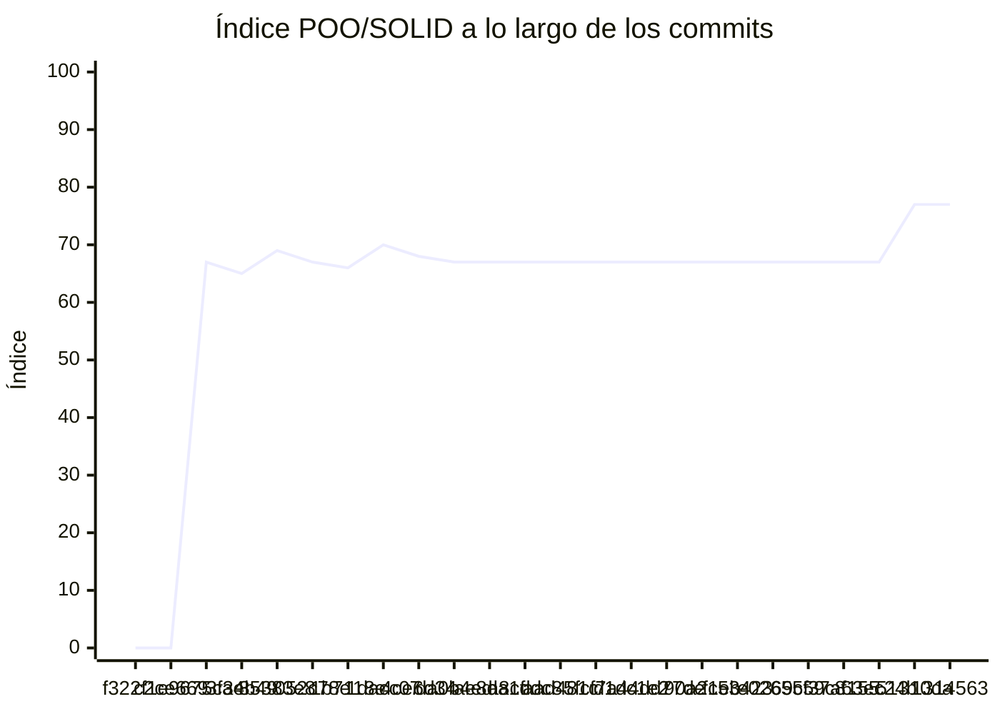

<!-- evaluacion:inicio -->
# Evaluación — centuriol/Proyecto_final_programacion2

> Documento **generado automáticamente** por la cátedra de Programación II (RepoSense + análisis de calidad POO/SOLID). **No editar a mano**: se regenera en cada evaluación.
> Rama evaluada: `main`. Análisis **heurístico** (regex + métricas): es una criba para orientar la revisión, **no una nota**.
> Generado: 2026-11-25.

## 1. Veredicto

| Aspecto | Resultado |
|---|---|
| Índice de calidad POO/SOLID | **77/100** |
| Commit evaluado | `1314563dd48c` (2026-11-20) |
| Código (LOC) | 24,028 |
| Archivos de código | 369 |
| Clases (bien usadas) | 429 (256 OK) |
| Código dentro de clases (%POO) | 100% |
| Funciones fuera de clases | 0 |
| Duplicación lógica | 0.5% |
| Señales S/O/L/I/D | 28/0/0/0/101 |

> Este informe **describe** lo que el análisis midió con los criterios ya establecidos de la materia. No es una nota.

### Semáforo de aprobación

Criterios de `CRITERIOS-CALIDAD.md`. **Aprobar** se juega con el perfil `estandar`; **destacar**, con el `exigente` (meta de excelencia).

| Semáforo | Resultado |
|---|---|
| Aprobar (`estandar`) | **no cumple** — 3/4 |
| Destacar (`exigente`) | **no cumple** — 4/5 |

**Criterios para aprobar**

| Criterio | Requisito | Tu resultado | Cumple |
|---|---|---|---|
| Código dentro de clases (%POO) | ≥ 85% | 100% | sí |
| Duplicación lógica | ≤ 10% | 0.5% | sí |
| Funciones fuera de clases | ≤ 1 | 0 | sí |
| Señales POO/SOLID críticas | ninguna | Baja cohesión (LCOM), Acoplamiento alto (CBO) | no |

**Criterios para destacar**

| Criterio | Requisito | Tu resultado | Cumple |
|---|---|---|---|
| Código dentro de clases (%POO) | ≥ 95% | 100% | sí |
| Duplicación lógica | ≤ 5% | 0.5% | sí |
| Funciones fuera de clases | ≤ 1 | 0 | sí |
| Señales POO/SOLID críticas | ninguna | Clase demasiado grande (SRP), Baja cohesión (LCOM), Complejidad alta, Acoplamiento alto (CBO) | no |
| Índice de calidad POO/SOLID | ≥ 60 | 77/100 | sí |

### Cómo se calcula el %POO (y por qué no sube solo)

`%POO = líneas de lógica dentro de clases ÷ líneas de lógica totales`.

Se cuentan las líneas de **lógica y campos**; no cuentan `package`/`import`/`using`/anotaciones ni comentarios, Javadoc o docstrings. Es una **proporción**: si agregás código nuevo dentro de una clase, el numerador y el denominador crecen juntos y el porcentaje casi no cambia.

Sube cuando el código que hoy está **fuera** de clases pasa a ser método de una clase (o desaparece): funciones sueltas, `main`, constantes de módulo, scripts y lógica de archivos sueltos. También importa que ese trabajo esté **integrado en `main`**: la evaluación siempre mide `main`, así que lo que sigue en otra rama no se refleja todavía.

## 2. Autoría (RepoSense)

| Autor | Commits | Código (LOC) | Tests (LOC) | Docs (LOC) | Días activos | % del código |
|---|---:|---:|---:|---:|---:|---:|
| minibautista14-tech | 15 | 12,635 | 3,639 | 153 | 12 | 61% |
| mateovarelac | 11 | 8,201 | 3,928 | 0 | 5 | 39% |

> _El LOC de autoría lo calcula RepoSense sobre el historial y puede diferir del LOC de código del análisis de calidad (que mira solo el estado de `main`)._

> **Reparto del trabajo:** minibautista14-tech concentra el 61% de las líneas de código. Un reparto muy desigual suele indicar que la integración no fue realmente en equipo; vale la pena reconstruir cómo se coordinó.

## 3. Fallas detectadas

Reúne lo que el análisis marcó y lo que todavía falta para cada semáforo. Cuando la señal se puede asociar a archivos, se indican para orientar la revisión. No es una nota.

| Falla | Tu resultado | Requisito | Archivos |
|---|---|---|---|
| Señales POO/SOLID críticas | Baja cohesión (LCOM), Acoplamiento alto (CBO) | Aprobar: ninguna Destacar: ninguna | `app/src/main/java/org/example/App.java`, `app/src/main/java/org/example/EnsambladorAplicacion.java`, `app/src/main/java/org/example/game/civilizacion/CivilizacionComponent.java`, `app/src/main/java/org/example/game/colonizacion/GestorColonizacion.java`, `app/src/main/java/org/example/game/colonizacion/ServicioPoblacionPlaneta.java`, `app/src/main/java/org/example/game/controlador/ConfiguradorAtajosSesion.java` (+99 más) |
| Métodos/funciones largos o con muchos parámetros | **95** método(s)/función(es) largos o con muchos parámetros | Sin señales | `app/src/main/java/org/example/game/civilizacion/CondicionesHabitabilidad.java`, `app/src/main/java/org/example/game/colonizacion/GestorColonizacion.java`, `app/src/main/java/org/example/game/controlador/CombinacionTeclas.java`, `app/src/main/java/org/example/game/controlador/SeleccionadorCuerpo.java`, `app/src/main/java/org/example/game/controlador/SeleccionadorCuerpoMouse.java`, `app/src/main/java/org/example/game/cuerpo/AgujeroNegro.java` (+68 más) |

## 4. Aspectos evaluados

Cada aspecto indica **qué mide**, **por qué importa** y **tu resultado**. Cuando el análisis reportó una señal, se agregan preguntas para **investigar la causa** (no hay recetas: entender el porqué es parte de la evaluación).

### 1. Índice de calidad POO/SOLID (indice)

- **Qué mide:** Un resumen numérico (0-100) que combina la riqueza de clases bien usadas con la penalización por señales POO/SOLID y duplicación, y luego aplica topes duros.
- **Por qué importa:** Ordena y prioriza la revisión: un índice bajo indica varias señales que conviene mirar juntas.
- **Tu resultado:** índice **77/100**

### 2. Duplicación lógica (DRY) (duplicacion) — sin señales

- **Qué mide:** Porcentaje de bloques de LÓGICA repetidos. Quedan fuera imports/includes, anotaciones, declaraciones de campos y comentarios/Javadoc/docstrings: esos bloques son boilerplate, no lógica.
- **Por qué importa:** Cada copia de lógica se mantiene por separado: un arreglo hay que repetirlo y los defectos se multiplican.
- **Tu resultado:** **0.5%** de duplicación lógica

### 3. Adopción de POO (% de código en clases) (poo) — sin señales

- **Qué mide:** Proporción de las **líneas de lógica** que viven dentro de una clase. Quedan fuera `package`/`import`/`using`/anotaciones y comentarios/Javadoc/docstrings: no son código que pueda estar dentro de una clase y, si contaran, el porcentaje quedaría topado por el boilerplate de cada archivo.
- **Por qué importa:** El diseño orientado a objetos es el eje de la materia: el comportamiento debería vivir como método de una clase.
- **Tu resultado:** **99.7%** del código dentro de clases
- **Cómo leerlo:** Es una **proporción**, no un acumulado: agregar código dentro de una clase no la sube por sí solo (numerador y denominador crecen juntos). Sube cuando el código que está **fuera** de clases (funciones sueltas, `main`, constantes de módulo, scripts) pasa a ser método de una clase o deja de existir. La medición se hace sobre `main`: el trabajo que todavía vive en otra rama no se refleja hasta que se integra.

### 4. Funciones fuera de clases (sueltas) — sin señales

- **Qué mide:** Funciones de nivel de módulo que no pertenecen a ninguna clase (en esta materia el comportamiento debe ser método de una clase).
- **Por qué importa:** Son la forma más directa de código procedural en un proyecto que debería ser orientado a objetos.
- **Tu resultado:** **0** función(es) fuera de clases

### 5. Clase demasiado grande (SRP) (god) — con señales

- **Qué mide:** Clases con demasiadas líneas o métodos de LÓGICA. No cuentan los getters/setters triviales ni la cantidad de campos por sí sola.
- **Por qué importa:** Una clase que hace de todo cambia por muchos motivos y cuesta entenderla y probarla.
- **Tu resultado:** **3** clase(s) demasiado grande(s)
- **Para investigar la causa:**
    - ¿La clase creció por acumulación de responsabilidades?
    - ¿Qué partes de la clase se usan siempre juntas y cuáles no?
    - ¿Se podría describir su responsabilidad en una sola frase?

### 6. Baja cohesión (LCOM) (cohesion) — con señales

- **Qué mide:** Métodos y campos de una clase que casi no se relacionan entre sí.
- **Por qué importa:** Una unidad que cambia por motivos distintos y comparte poca información suele esconder más de una responsabilidad.
- **Tu resultado:** **24** clase(s) con baja cohesión
- **Para investigar la causa:**
    - ¿Qué métodos de la clase no comparten estado con el resto?
    - ¿Cambian por motivos distintos según la tarea?
    - ¿Se pensó su responsabilidad antes de escribirla, o se fue agregando?

### 7. Complejidad alta (complejidad) — con señales

- **Qué mide:** Complejidad ciclomática: cantidad de caminos posibles dentro de un método o función (condicionales, bucles, casos).
- **Por qué importa:** Muchos caminos = difícil de seguir y de probar; suelen esconderse casos sin cubrir.
- **Tu resultado:** **1** método(s)/función(es) con complejidad alta
- **Para investigar la causa:**
    - ¿Se agregaron condiciones a medida que aparecían casos nuevos?
    - ¿Se probaron todos los caminos o solo el caso principal?
    - ¿Hay reglas de negocio mezcladas con detalles técnicos?

### 8. Métodos/funciones largos o con muchos parámetros (tamano) — con señales

- **Qué mide:** Tamaño de los métodos/funciones y cantidad de parámetros.
- **Por qué importa:** Una función que hace varias cosas cuesta leerla, nombrarla y reutilizarla.
- **Tu resultado:** **95** método(s)/función(es) largos o con muchos parámetros
- **Para investigar la causa:**
    - ¿La función creció por acumulación de pasos?
    - ¿Agrupa operaciones que podrían describirse por separado?
    - ¿Los parámetros representan una misma idea (un objeto) o cosas sueltas?

### 9. Acoplamiento alto (CBO) (acoplamiento) — con señales

- **Qué mide:** Cuánto depende una clase de otros tipos del proyecto. No cuentan los tipos de la plataforma (biblioteca estándar, DOM, motor Godot) ni los métodos/propiedades propias.
- **Por qué importa:** Piezas muy enlazadas hacen que un cambio se propague y que sea difícil reemplazar partes.
- **Tu resultado:** **101** clase(s) muy acoplada(s)
- **Para investigar la causa:**
    - ¿La clase conoce detalles internos de muchas otras?
    - ¿Se puede cambiar una parte sin tocar las demás?
    - ¿Los colaboradores llegan como parámetros o se crean por dentro?

### 10. Herencia profunda (DIT) (herencia) — sin señales

- **Qué mide:** Profundidad de la cadena de herencia de una clase.
- **Por qué importa:** Jerarquías muy profundas vuelven difícil saber de dónde viene cada comportamiento.
- **Tu resultado:** **0** clase(s) con herencia profunda

### 11. Switch sobre tipos (OCP) (ocp) — sin señales

- **Qué mide:** Cadenas de dispatch por tipo (`else if ... is` / `else if ... instanceof`, `switch` sobre tipo o `typeof`). Un `is Tipo variable` aislado (pattern matching / cast seguro) NO cuenta como switch.
- **Por qué importa:** Cada tipo nuevo obliga a tocar varios lugares, en vez de extender con una implementación nueva.
- **Tu resultado:** **0** clase(s) con switch sobre tipos

### 12. Interfaz con demasiados métodos (ISP) (isp) — sin señales

- **Qué mide:** Interfaces o clases abstractas con muchos métodos declarados.
- **Por qué importa:** Obliga a implementar operaciones que no se usan y acopla a los clientes a métodos que no necesitan.
- **Tu resultado:** **0** interfaz(es) con demasiados métodos

### 13. Override vacío o 'no implementado' (LSP) (lsp) — sin señales

- **Qué mide:** Métodos sobrescritos que quedan vacíos o lanzan 'no implementado'.
- **Por qué importa:** Suele indicar que la jerarquía no representa bien el problema y rompe la sustitución entre clases.
- **Tu resultado:** **0** override(s) vacío(s) o 'no implementado'

### 14. Clase sin métodos (solo datos) (data) — sin señales

- **Qué mide:** Clases que solo acumulan campos y no tienen comportamiento.
- **Por qué importa:** Separar datos de comportamiento reparte por el proyecto la lógica que debería estar cerca de esos datos.
- **Tu resultado:** **0** clase(s) sin métodos (solo datos)

### 15. Campos mutables públicos (encapsulación) (encapsulacion) — sin señales

- **Qué mide:** Clases que exponen estado **modificable** desde afuera. No cuentan constantes (`static final`, `const`), campos `final`/`readonly`, propiedades `val` de Kotlin ni propiedades con `private set`.
- **Por qué importa:** Expone el estado interno y hace que cualquier cambio dependa de quién lo modifica desde afuera.
- **Tu resultado:** **0** clase(s) con campos mutables públicos

### 16. Clase solo con métodos estáticos (utilitaria) (static) — sin señales

- **Qué mide:** Clases donde todos los métodos son estáticos.
- **Por qué importa:** Es comportamiento procedural disfrazado de clase: no se instancia ni participa del modelo de objetos.
- **Tu resultado:** **0** clase(s) solo con métodos estáticos

### Resumen de señales por tipo

| Señal | Cantidad | Principio | Archivos |
|---|---:|---|---:|
| acoplamiento alto | 101 | D | 97 |
| muchos parámetros | 66 | S | 49 |
| método largo | 29 | S | 27 |
| baja cohesión | 24 | S | 24 |
| clase grande | 3 | S | 3 |
| complejidad alta | 1 | S | 1 |

### Resumen por archivo

> Archivos ordenados por cantidad de señales. Se excluyen **0** señal(es) de nivel repositorio sin archivo propio.

| Archivo | Señales | Aspectos | Líneas |
|---|---:|---|---|
| `app/src/main/java/org/example/game/simulacion/GestorCicloVidaCuerpos.java` | 8 | acoplamiento, cohesión, tamaño | 17, 28, 36, 70, 74 |
| `app/src/main/java/org/example/game/cuerpo/CuerpoCelesteFactory.java` | 6 | acoplamiento, tamaño | 12, 28, 33, 37, 51, 65 |
| `app/src/main/java/org/example/game/colonizacion/GestorColonizacion.java` | 3 | acoplamiento, cohesión, tamaño | 19, 89 |
| `app/src/main/java/org/example/game/motor/PipelineFisicaPermisiva.java` | 3 | acoplamiento, cohesión | 19, 41 |
| `app/src/main/java/org/example/game/motor/colision/ReglaColisionAgujeroNegro.java` | 3 | acoplamiento, tamaño | 15, 34, 79 |
| `app/src/main/java/org/example/game/render/capa/CapaGhostPreview.java` | 3 | tamaño | 57, 80, 99 |
| `app/src/main/java/org/example/game/ui/PantallaArbolProgresion.java` | 3 | acoplamiento, tamaño | 21, 23 |
| `app/src/main/java/org/example/game/ui/SeccionInfoCuerpo.java` | 3 | acoplamiento, cohesión, tamaño | 26, 103 |
| `app/src/main/java/org/example/game/ui/VentanaColocacion.java` | 3 | acoplamiento, tamaño | 27, 45, 96 |
| `app/src/test/java/org/example/CostosProporcionalesYSatelitesMenuTest.java` | 3 | acoplamiento, tamaño | 25, 28, 157 |
| `app/src/test/java/org/example/TransformacionCuerposTest.java` | 3 | acoplamiento, clase grande, tamaño | 15, 252 |
| `app/src/main/java/org/example/EnsambladorAplicacion.java` | 2 | acoplamiento | 19, 21 |
| `app/src/main/java/org/example/game/civilizacion/CivilizacionComponent.java` | 2 | acoplamiento, clase grande | 15 |
| `app/src/main/java/org/example/game/controlador/ControladorMouse.java` | 2 | acoplamiento | 21, 25 |
| `app/src/main/java/org/example/game/cuerpo/CreadorPlanetas.java` | 2 | tamaño | 9, 10 |
| `app/src/main/java/org/example/game/cuerpo/FabricaPlanetas.java` | 2 | tamaño | 19, 27 |
| `app/src/main/java/org/example/game/cuerpo/RegistroCreadoresCuerpo.java` | 2 | acoplamiento, tamaño | 13, 42 |
| `app/src/main/java/org/example/game/guardado/DatosPartida.java` | 2 | tamaño | 11 |
| `app/src/main/java/org/example/game/motor/AsistenteOrbital.java` | 2 | acoplamiento, cohesión | 10 |
| `app/src/main/java/org/example/game/motor/CalculadorGravedad.java` | 2 | tamaño | 91, 116 |
| `app/src/main/java/org/example/game/motor/ResolvedorColisiones.java` | 2 | acoplamiento, cohesión | 17 |
| `app/src/main/java/org/example/game/progresion/MejoraSecundaria.java` | 2 | cohesión, complejidad | 13, 234 |
| `app/src/main/java/org/example/game/progresion/SistemaProgresion.java` | 2 | acoplamiento, clase grande | 14 |
| `app/src/main/java/org/example/game/render/CapaEstrellasFondo.java` | 2 | tamaño | 14 |
| `app/src/main/java/org/example/game/render/CapasVisualesSimulacion.java` | 2 | acoplamiento | 18, 22 |
| `app/src/main/java/org/example/game/render/DespachadorRenderCuerpo.java` | 2 | acoplamiento, tamaño | 19, 101 |
| `app/src/main/java/org/example/game/render/EscenaFondoMenu.java` | 2 | acoplamiento, cohesión | 19 |
| `app/src/main/java/org/example/game/render/GestorImagenes.java` | 2 | acoplamiento, cohesión | 14 |
| `app/src/main/java/org/example/game/render/RegistroEstrategiasVisuales.java` | 2 | acoplamiento, cohesión | 14 |
| `app/src/main/java/org/example/game/render/RenderizadorPixelArt.java` | 2 | acoplamiento, cohesión | 18 |
| `app/src/main/java/org/example/game/render/UtilidadRender.java` | 2 | tamaño | 38, 48 |
| `app/src/main/java/org/example/game/ui/BarraInventarioHotbar.java` | 2 | acoplamiento, cohesión | 20 |
| `app/src/main/java/org/example/game/ui/ConstructorOrbeNodoArbol.java` | 2 | acoplamiento, tamaño | 26, 255 |
| `app/src/main/java/org/example/game/ui/ConstructorTarjetasInspeccion.java` | 2 | acoplamiento, tamaño | 28, 61 |
| `app/src/main/java/org/example/game/ui/ControlTiempoWidget.java` | 2 | acoplamiento, cohesión | 17 |
| `app/src/main/java/org/example/game/ui/InspectorTecnologiaArbol.java` | 2 | acoplamiento, tamaño | 28, 47 |
| `app/src/main/java/org/example/game/ui/LienzoArbolOrbital.java` | 2 | acoplamiento, cohesión | 22 |
| `app/src/main/java/org/example/game/ui/PantallaGameOver.java` | 2 | acoplamiento, cohesión | 19 |
| `app/src/main/java/org/example/game/ui/PantallaMenuPausa.java` | 2 | acoplamiento, cohesión | 16 |
| `app/src/main/java/org/example/game/ui/PantallaMenuPrincipal.java` | 2 | acoplamiento, cohesión | 21 |
| `app/src/main/java/org/example/game/ui/SlotHotbar.java` | 2 | acoplamiento, tamaño | 21, 33 |
| `app/src/test/java/org/example/CorreccionesMeteoritosAutoguardadoEconomiaTest.java` | 2 | acoplamiento, tamaño | 49, 74 |
| `app/src/test/java/org/example/EasterEggFusionYRadiosTest.java` | 2 | acoplamiento, tamaño | 4, 51 |
| `app/src/test/java/org/example/EventosCosmicosYSatelitesTest.java` | 2 | acoplamiento, tamaño | 4, 193 |
| `app/src/test/java/org/example/GuardadoYCargaSimulacionTest.java` | 2 | acoplamiento, tamaño | 25, 31 |
| `app/src/test/java/org/example/ProgresionMejorasSecundariasTest.java` | 2 | acoplamiento, tamaño | 26, 68 |
| `app/src/test/java/org/example/ReembolsoYColocacionTest.java` | 2 | acoplamiento, tamaño | 16, 148 |
| `app/src/test/java/org/example/RepositorioYSerializacionPartidaTest.java` | 2 | acoplamiento, tamaño | 19, 145 |
| `app/src/test/java/org/example/UIWidgetsYFormatoTest.java` | 2 | acoplamiento, tamaño | 17, 118 |
| `app/src/main/java/org/example/App.java` | 1 | acoplamiento | 22 |
| `app/src/main/java/org/example/game/civilizacion/CondicionesHabitabilidad.java` | 1 | tamaño | 6 |
| `app/src/main/java/org/example/game/colonizacion/ServicioPoblacionPlaneta.java` | 1 | acoplamiento | 21 |
| `app/src/main/java/org/example/game/controlador/CombinacionTeclas.java` | 1 | tamaño | 9 |
| `app/src/main/java/org/example/game/controlador/ConfiguradorAtajosSesion.java` | 1 | acoplamiento | 14 |
| `app/src/main/java/org/example/game/controlador/ConfiguradorAtajosTeclado.java` | 1 | acoplamiento | 12 |
| `app/src/main/java/org/example/game/controlador/ControladorTeclado.java` | 1 | acoplamiento | 20 |
| `app/src/main/java/org/example/game/controlador/CoordinadorSesionJuego.java` | 1 | acoplamiento | 18 |
| `app/src/main/java/org/example/game/controlador/ManejadorClicksCanvas.java` | 1 | acoplamiento | 18 |
| `app/src/main/java/org/example/game/controlador/SeleccionadorCuerpo.java` | 1 | tamaño | 10 |
| `app/src/main/java/org/example/game/controlador/SeleccionadorCuerpoMouse.java` | 1 | tamaño | 26 |
| `app/src/main/java/org/example/game/cuerpo/AgujeroNegro.java` | 1 | tamaño | 9 |
| `app/src/main/java/org/example/game/cuerpo/CreadorAgujerosNegros.java` | 1 | tamaño | 9 |
| `app/src/main/java/org/example/game/cuerpo/CreadorAstrosMenoresYEstrellas.java` | 1 | tamaño | 12 |
| `app/src/main/java/org/example/game/cuerpo/CuerpoCeleste.java` | 1 | tamaño | 17 |
| `app/src/main/java/org/example/game/cuerpo/DescriptorTipoCuerpo.java` | 1 | tamaño | 12 |
| `app/src/main/java/org/example/game/cuerpo/FabricaCuerpos.java` | 1 | tamaño | 15 |
| `app/src/main/java/org/example/game/cuerpo/FabricaMeteoritos.java` | 1 | tamaño | 28 |
| `app/src/main/java/org/example/game/cuerpo/Planeta.java` | 1 | tamaño | 13 |
| `app/src/main/java/org/example/game/cuerpo/RegistroCapacidades.java` | 1 | acoplamiento | 16 |
| `app/src/main/java/org/example/game/efectos/GestorEfectos.java` | 1 | cohesión | 17 |
| `app/src/main/java/org/example/game/guardado/CodificadorEntidadesPartida.java` | 1 | acoplamiento | 9 |
| `app/src/main/java/org/example/game/guardado/DatosCivilizacion.java` | 1 | tamaño | 7 |
| `app/src/main/java/org/example/game/guardado/DatosCuerpo.java` | 1 | tamaño | 7 |
| `app/src/main/java/org/example/game/guardado/DetalleCuerpo.java` | 1 | tamaño | 5 |
| `app/src/main/java/org/example/game/guardado/DiccionarioPropiedades.java` | 1 | acoplamiento | 11 |
| `app/src/main/java/org/example/game/guardado/EstadoRelojGuardado.java` | 1 | tamaño | 7 |
| `app/src/main/java/org/example/game/guardado/ExtractorDatosCuerpo.java` | 1 | acoplamiento | 11 |
| `app/src/main/java/org/example/game/guardado/FabricaGuardado.java` | 1 | acoplamiento | 8 |
| `app/src/main/java/org/example/game/guardado/GestorGuardadoPartida.java` | 1 | acoplamiento | 15 |
| `app/src/main/java/org/example/game/guardado/InfoRanuraGuardado.java` | 1 | tamaño | 9 |
| `app/src/main/java/org/example/game/guardado/MapeadorEstadoSimulacion.java` | 1 | acoplamiento | 21 |
| `app/src/main/java/org/example/game/guardado/PoliticaRanurasGuardado.java` | 1 | cohesión | 13 |
| `app/src/main/java/org/example/game/guardado/ReconstructorCuerpos.java` | 1 | acoplamiento | 16 |
| `app/src/main/java/org/example/game/guardado/RepositorioPartidasArchivo.java` | 1 | acoplamiento | 15 |
| `app/src/main/java/org/example/game/guardado/SerializadorPartidaTexto.java` | 1 | acoplamiento | 16 |
| `app/src/main/java/org/example/game/guardado/ServicioPersistenciaSlot.java` | 1 | tamaño | 27 |
| `app/src/main/java/org/example/game/jugador/InventarioJugador.java` | 1 | cohesión | 13 |
| `app/src/main/java/org/example/game/motor/ActualizadorProcesosTransformacion.java` | 1 | acoplamiento | 16 |
| `app/src/main/java/org/example/game/motor/CapturaOrbitalMenorPlaneta.java` | 1 | tamaño | 49 |
| `app/src/main/java/org/example/game/motor/CapturaOrbitalPlanetaAtractor.java` | 1 | tamaño | 26 |
| `app/src/main/java/org/example/game/motor/EstrategiaCapturaOrbital.java` | 1 | tamaño | 9 |
| `app/src/main/java/org/example/game/motor/FabricaMotorFisica.java` | 1 | acoplamiento | 9 |
| `app/src/main/java/org/example/game/motor/IntegradorMovimiento.java` | 1 | tamaño | 21 |
| `app/src/main/java/org/example/game/motor/MotorFisicaPermisiva.java` | 1 | acoplamiento | 13 |
| `app/src/main/java/org/example/game/motor/MotorReglasColision.java` | 1 | acoplamiento | 20 |
| `app/src/main/java/org/example/game/motor/TransformadorCuerpos.java` | 1 | acoplamiento | 13 |
| `app/src/main/java/org/example/game/motor/Vector2D.java` | 1 | tamaño | 7 |
| `app/src/main/java/org/example/game/motor/colision/ContextoColision.java` | 1 | tamaño | 12 |
| `app/src/main/java/org/example/game/motor/colision/ReglaColisionEscudo.java` | 1 | acoplamiento | 16 |
| `app/src/main/java/org/example/game/motor/colision/ReglaColisionEstrella.java` | 1 | acoplamiento | 14 |
| `app/src/main/java/org/example/game/motor/colision/ReglaColisionFusionAguaLava.java` | 1 | tamaño | 43 |
| `app/src/main/java/org/example/game/progresion/RegistroMejorasSecundarias.java` | 1 | acoplamiento | 16 |
| `app/src/main/java/org/example/game/render/CapaGrillaEspacial.java` | 1 | tamaño | 27 |
| `app/src/main/java/org/example/game/render/DesplazamientoCamara.java` | 1 | cohesión | 9 |
| `app/src/main/java/org/example/game/render/FabricaRender.java` | 1 | acoplamiento | 10 |
| `app/src/main/java/org/example/game/render/RenderizadorCuerpo.java` | 1 | tamaño | 14 |
| `app/src/main/java/org/example/game/render/RenderizadorFondo.java` | 1 | acoplamiento | 10 |
| `app/src/main/java/org/example/game/render/capa/CapaEscudoPlanetario.java` | 1 | tamaño | 27 |
| `app/src/main/java/org/example/game/render/cuerpo/RenderizadorAgujeroNegro.java` | 1 | tamaño | 15 |
| `app/src/main/java/org/example/game/render/cuerpo/RenderizadorEstrella.java` | 1 | tamaño | 21 |
| `app/src/main/java/org/example/game/render/cuerpo/RenderizadorLuna.java` | 1 | tamaño | 21 |
| `app/src/main/java/org/example/game/render/cuerpo/RenderizadorMeteorito.java` | 1 | tamaño | 15 |
| `app/src/main/java/org/example/game/render/cuerpo/RenderizadorPlaneta.java` | 1 | tamaño | 41 |
| `app/src/main/java/org/example/game/render/cuerpo/RenderizadorSatelite.java` | 1 | tamaño | 14 |
| `app/src/main/java/org/example/game/simulacion/BusEventos.java` | 1 | cohesión | 11 |
| `app/src/main/java/org/example/game/simulacion/CoordinadorPasoSimulacion.java` | 1 | acoplamiento | 20 |
| `app/src/main/java/org/example/game/simulacion/FabricaSimulacion.java` | 1 | acoplamiento | 14 |
| `app/src/main/java/org/example/game/simulacion/GeneradorEventosCosmicos.java` | 1 | cohesión | 13 |
| `app/src/main/java/org/example/game/simulacion/GestorColocacionCuerpos.java` | 1 | acoplamiento | 14 |
| `app/src/main/java/org/example/game/simulacion/SimulacionSolar.java` | 1 | acoplamiento | 17 |
| `app/src/main/java/org/example/game/simulacion/SubsistemaSimulacion.java` | 1 | acoplamiento | 23 |
| `app/src/main/java/org/example/game/ui/BarraResumenProgresion.java` | 1 | tamaño | 36 |
| `app/src/main/java/org/example/game/ui/CapaIndicadoresSol.java` | 1 | cohesión | 25 |
| `app/src/main/java/org/example/game/ui/ConstructorOverlayUI.java` | 1 | acoplamiento | 17 |
| `app/src/main/java/org/example/game/ui/ConstructorPanelCaracteristicas.java` | 1 | tamaño | 52 |
| `app/src/main/java/org/example/game/ui/FormateadorHotbar.java` | 1 | tamaño | 42 |
| `app/src/main/java/org/example/game/ui/ProveedorInfoCuerpo.java` | 1 | tamaño | 18 |
| `app/src/main/java/org/example/game/ui/RenderizadorGeometriaArbol.java` | 1 | tamaño | 82 |
| `app/src/main/java/org/example/game/ui/VentanaDescripcionCuerpo.java` | 1 | acoplamiento | 13 |
| `app/src/main/java/org/example/game/ui/VentanaInspeccion.java` | 1 | acoplamiento | 24 |
| `app/src/main/java/org/example/game/ui/VentanaProgresion.java` | 1 | acoplamiento | 26 |
| `app/src/main/java/org/example/game/ui/WidgetFactorMasa.java` | 1 | tamaño | 31 |
| `app/src/test/java/org/example/AgujeroNegroFisicaTest.java` | 1 | acoplamiento | 14 |
| `app/src/test/java/org/example/ArrastreCamaraYColocacionTest.java` | 1 | acoplamiento | 25 |
| `app/src/test/java/org/example/CivilizacionSinergiaTest.java` | 1 | tamaño | 26 |
| `app/src/test/java/org/example/ColonizacionYEscudosTest.java` | 1 | acoplamiento | 23 |
| `app/src/test/java/org/example/ControladorMouseYHelpersTest.java` | 1 | acoplamiento | 25 |
| `app/src/test/java/org/example/ControladorTecladoYComandosTest.java` | 1 | acoplamiento | 19 |
| `app/src/test/java/org/example/EconomiaRecursosTest.java` | 1 | tamaño | 92 |
| `app/src/test/java/org/example/Fase2BugsTest.java` | 1 | acoplamiento | 22 |
| `app/src/test/java/org/example/FondoAnimadoMenuPrincipalTest.java` | 1 | acoplamiento | 17 |
| `app/src/test/java/org/example/GuardadoComandosYFlujoTest.java` | 1 | acoplamiento | 24 |
| `app/src/test/java/org/example/MecanicasColisionYVidaTest.java` | 1 | acoplamiento | 4 |
| `app/src/test/java/org/example/MenuPausaYDisposicionUITest.java` | 1 | acoplamiento | 22 |
| `app/src/test/java/org/example/MenuPrincipalYDerrotaFlujoTest.java` | 1 | acoplamiento | 19 |
| `app/src/test/java/org/example/OrbitasYDinamicaTest.java` | 1 | acoplamiento | 4 |
| `app/src/test/java/org/example/ProgresionYArbolTest.java` | 1 | tamaño | 31 |
| `app/src/test/java/org/example/RanurasYAutoguardadoTest.java` | 1 | acoplamiento | 18 |
| `app/src/test/java/org/example/RefactorOopModularidadTest.java` | 1 | acoplamiento | 22 |
| `app/src/test/java/org/example/ReglasColisionTest.java` | 1 | acoplamiento | 9 |
| `app/src/test/java/org/example/RendimientoRegresionTest.java` | 1 | acoplamiento | 21 |
| `app/src/test/java/org/example/SolidAbstraccionesRefactorTest.java` | 1 | acoplamiento | 27 |
| `app/src/test/java/org/example/game/motor/colision/DespachoDobleColisionesTest.java` | 1 | acoplamiento | 21 |
| `app/src/test/java/org/example/game/render/capa/CapaNavesYEscudoTest.java` | 1 | acoplamiento | 18 |
| `app/src/test/java/org/example/game/ui/ConstructorFichaInvestigacionTest.java` | 1 | tamaño | 30 |
| `app/src/test/java/org/example/game/ui/FabricaPantallasModalesTest.java` | 1 | acoplamiento | 16 |

### Archivos donde se originan las señales

> Se listan **224** hallazgo(s) localizados en **156** archivo(s). La columna `Línea` es la línea del archivo donde el análisis detectó la señal; `—` indica una señal de nivel repositorio (sin archivo propio).

| Aspecto | Archivo | Línea | Hallazgo |
|---|---|---:|---|
| Clase demasiado grande (SRP) | `app/src/main/java/org/example/game/civilizacion/CivilizacionComponent.java` | 15 | clase 'CivilizacionComponent' grande (LOC lógico=103, métodos=19, campos=6, accesores=10 (no cuentan)) |
| Clase demasiado grande (SRP) | `app/src/main/java/org/example/game/progresion/SistemaProgresion.java` | 14 | clase 'SistemaProgresion' grande (LOC lógico=100, métodos=37, campos=3, accesores=6 (no cuentan)) |
| Clase demasiado grande (SRP) | `app/src/test/java/org/example/TransformacionCuerposTest.java` | 15 | clase 'TransformacionCuerposTest' grande (LOC lógico=219, métodos=12, campos=1) |
| Baja cohesión (LCOM) | `app/src/main/java/org/example/game/colonizacion/GestorColonizacion.java` | 19 | clase 'GestorColonizacion' con baja cohesión (34%) |
| Baja cohesión (LCOM) | `app/src/main/java/org/example/game/efectos/GestorEfectos.java` | 17 | clase 'GestorEfectos' con baja cohesión (47%) |
| Baja cohesión (LCOM) | `app/src/main/java/org/example/game/guardado/PoliticaRanurasGuardado.java` | 13 | clase 'PoliticaRanurasGuardado' con baja cohesión (33%) |
| Baja cohesión (LCOM) | `app/src/main/java/org/example/game/jugador/InventarioJugador.java` | 13 | clase 'InventarioJugador' con baja cohesión (38%) |
| Baja cohesión (LCOM) | `app/src/main/java/org/example/game/motor/AsistenteOrbital.java` | 10 | clase 'AsistenteOrbital' con baja cohesión (49%) |
| Baja cohesión (LCOM) | `app/src/main/java/org/example/game/motor/PipelineFisicaPermisiva.java` | 19 | clase 'PipelineFisicaPermisiva' con baja cohesión (29%) |
| Baja cohesión (LCOM) | `app/src/main/java/org/example/game/motor/ResolvedorColisiones.java` | 17 | clase 'ResolvedorColisiones' con baja cohesión (49%) |
| Baja cohesión (LCOM) | `app/src/main/java/org/example/game/progresion/MejoraSecundaria.java` | 13 | clase 'MejoraSecundaria' con baja cohesión (11%) |
| Baja cohesión (LCOM) | `app/src/main/java/org/example/game/render/DesplazamientoCamara.java` | 9 | clase 'DesplazamientoCamara' con baja cohesión (47%) |
| Baja cohesión (LCOM) | `app/src/main/java/org/example/game/render/EscenaFondoMenu.java` | 19 | clase 'EscenaFondoMenu' con baja cohesión (28%) |
| Baja cohesión (LCOM) | `app/src/main/java/org/example/game/render/GestorImagenes.java` | 14 | clase 'GestorImagenes' con baja cohesión (35%) |
| Baja cohesión (LCOM) | `app/src/main/java/org/example/game/render/RegistroEstrategiasVisuales.java` | 14 | clase 'RegistroEstrategiasVisuales' con baja cohesión (33%) |
| Baja cohesión (LCOM) | `app/src/main/java/org/example/game/render/RenderizadorPixelArt.java` | 18 | clase 'RenderizadorPixelArt' con baja cohesión (35%) |
| Baja cohesión (LCOM) | `app/src/main/java/org/example/game/simulacion/BusEventos.java` | 11 | clase 'BusEventos' con baja cohesión (31%) |
| Baja cohesión (LCOM) | `app/src/main/java/org/example/game/simulacion/GeneradorEventosCosmicos.java` | 13 | clase 'GeneradorEventosCosmicos' con baja cohesión (40%) |
| Baja cohesión (LCOM) | `app/src/main/java/org/example/game/simulacion/GestorCicloVidaCuerpos.java` | 17 | clase 'GestorCicloVidaCuerpos' con baja cohesión (42%) |
| Baja cohesión (LCOM) | `app/src/main/java/org/example/game/ui/BarraInventarioHotbar.java` | 20 | clase 'BarraInventarioHotbar' con baja cohesión (42%) |
| Baja cohesión (LCOM) | `app/src/main/java/org/example/game/ui/CapaIndicadoresSol.java` | 25 | clase 'CapaIndicadoresSol' con baja cohesión (33%) |
| Baja cohesión (LCOM) | `app/src/main/java/org/example/game/ui/ControlTiempoWidget.java` | 17 | clase 'ControlTiempoWidget' con baja cohesión (36%) |
| Baja cohesión (LCOM) | `app/src/main/java/org/example/game/ui/LienzoArbolOrbital.java` | 22 | clase 'LienzoArbolOrbital' con baja cohesión (17%) |
| Baja cohesión (LCOM) | `app/src/main/java/org/example/game/ui/PantallaGameOver.java` | 19 | clase 'PantallaGameOver' con baja cohesión (43%) |
| Baja cohesión (LCOM) | `app/src/main/java/org/example/game/ui/PantallaMenuPausa.java` | 16 | clase 'PantallaMenuPausa' con baja cohesión (43%) |
| Baja cohesión (LCOM) | `app/src/main/java/org/example/game/ui/PantallaMenuPrincipal.java` | 21 | clase 'PantallaMenuPrincipal' con baja cohesión (38%) |
| Baja cohesión (LCOM) | `app/src/main/java/org/example/game/ui/SeccionInfoCuerpo.java` | 26 | clase 'SeccionInfoCuerpo' con baja cohesión (38%) |
| Complejidad alta | `app/src/main/java/org/example/game/progresion/MejoraSecundaria.java` | 234 | método 'MejoraSecundaria.formatearEfecto' con complejidad 10 |
| Métodos/funciones largos o con muchos parámetros | `app/src/main/java/org/example/game/civilizacion/CondicionesHabitabilidad.java` | 6 | método 'CondicionesHabitabilidad.CondicionesHabitabilidad' con 9 parámetros |
| Métodos/funciones largos o con muchos parámetros | `app/src/main/java/org/example/game/colonizacion/GestorColonizacion.java` | 89 | método 'GestorColonizacion.lanzar' con 5 parámetros |
| Métodos/funciones largos o con muchos parámetros | `app/src/main/java/org/example/game/controlador/CombinacionTeclas.java` | 9 | método 'CombinacionTeclas.CombinacionTeclas' de 47 líneas |
| Métodos/funciones largos o con muchos parámetros | `app/src/main/java/org/example/game/controlador/SeleccionadorCuerpo.java` | 10 | método 'SeleccionadorCuerpo.encontrarCuerpo' con 5 parámetros |
| Métodos/funciones largos o con muchos parámetros | `app/src/main/java/org/example/game/controlador/SeleccionadorCuerpoMouse.java` | 26 | método 'SeleccionadorCuerpoMouse.encontrarCuerpo' con 5 parámetros |
| Métodos/funciones largos o con muchos parámetros | `app/src/main/java/org/example/game/cuerpo/AgujeroNegro.java` | 9 | método 'AgujeroNegro.AgujeroNegro' con 5 parámetros |
| Métodos/funciones largos o con muchos parámetros | `app/src/main/java/org/example/game/cuerpo/CreadorAgujerosNegros.java` | 9 | método 'CreadorAgujerosNegros.crearAgujeroNegro' con 5 parámetros |
| Métodos/funciones largos o con muchos parámetros | `app/src/main/java/org/example/game/cuerpo/CreadorAstrosMenoresYEstrellas.java` | 12 | método 'CreadorAstrosMenoresYEstrellas.crearLunaPersonalizada' con 5 parámetros |
| Métodos/funciones largos o con muchos parámetros | `app/src/main/java/org/example/game/cuerpo/CreadorPlanetas.java` | 9 | método 'CreadorPlanetas.crearPlaneta' con 5 parámetros |
| Métodos/funciones largos o con muchos parámetros | `app/src/main/java/org/example/game/cuerpo/CreadorPlanetas.java` | 10 | método 'CreadorPlanetas.crearPlanetaPersonalizado' con 6 parámetros |
| Métodos/funciones largos o con muchos parámetros | `app/src/main/java/org/example/game/cuerpo/CuerpoCeleste.java` | 17 | método 'CuerpoCeleste.CuerpoCeleste' con 5 parámetros |
| Métodos/funciones largos o con muchos parámetros | `app/src/main/java/org/example/game/cuerpo/CuerpoCelesteFactory.java` | 28 | método 'CuerpoCelesteFactory.crearCuerpo' con 5 parámetros |
| Métodos/funciones largos o con muchos parámetros | `app/src/main/java/org/example/game/cuerpo/CuerpoCelesteFactory.java` | 33 | método 'CuerpoCelesteFactory.crearPlaneta' con 5 parámetros |
| Métodos/funciones largos o con muchos parámetros | `app/src/main/java/org/example/game/cuerpo/CuerpoCelesteFactory.java` | 37 | método 'CuerpoCelesteFactory.crearPlanetaPersonalizado' con 6 parámetros |
| Métodos/funciones largos o con muchos parámetros | `app/src/main/java/org/example/game/cuerpo/CuerpoCelesteFactory.java` | 51 | método 'CuerpoCelesteFactory.crearLunaPersonalizada' con 5 parámetros |
| Métodos/funciones largos o con muchos parámetros | `app/src/main/java/org/example/game/cuerpo/CuerpoCelesteFactory.java` | 65 | método 'CuerpoCelesteFactory.crearAgujeroNegro' con 5 parámetros |
| Métodos/funciones largos o con muchos parámetros | `app/src/main/java/org/example/game/cuerpo/DescriptorTipoCuerpo.java` | 12 | método 'DescriptorTipoCuerpo.DescriptorTipoCuerpo' con 11 parámetros |
| Métodos/funciones largos o con muchos parámetros | `app/src/main/java/org/example/game/cuerpo/FabricaCuerpos.java` | 15 | método 'FabricaCuerpos.crearCuerpo' con 5 parámetros |
| Métodos/funciones largos o con muchos parámetros | `app/src/main/java/org/example/game/cuerpo/FabricaMeteoritos.java` | 28 | método 'FabricaMeteoritos.crearHaciaObjetivo' de 35 líneas |
| Métodos/funciones largos o con muchos parámetros | `app/src/main/java/org/example/game/cuerpo/FabricaPlanetas.java` | 19 | método 'FabricaPlanetas.crearPlaneta' con 5 parámetros |
| Métodos/funciones largos o con muchos parámetros | `app/src/main/java/org/example/game/cuerpo/FabricaPlanetas.java` | 27 | método 'FabricaPlanetas.crearPlanetaPersonalizado' con 6 parámetros |
| Métodos/funciones largos o con muchos parámetros | `app/src/main/java/org/example/game/cuerpo/Planeta.java` | 13 | método 'Planeta.Planeta' con 5 parámetros |
| Métodos/funciones largos o con muchos parámetros | `app/src/main/java/org/example/game/cuerpo/RegistroCreadoresCuerpo.java` | 42 | método 'RegistroCreadoresCuerpo.crear' con 5 parámetros |
| Métodos/funciones largos o con muchos parámetros | `app/src/main/java/org/example/game/guardado/DatosCivilizacion.java` | 7 | método 'DatosCivilizacion.DatosCivilizacion' con 6 parámetros |
| Métodos/funciones largos o con muchos parámetros | `app/src/main/java/org/example/game/guardado/DatosCuerpo.java` | 7 | método 'DatosCuerpo.DatosCuerpo' con 6 parámetros |
| Métodos/funciones largos o con muchos parámetros | `app/src/main/java/org/example/game/guardado/DatosPartida.java` | 11 | método 'DatosPartida.DatosPartida' con 6 parámetros |
| Métodos/funciones largos o con muchos parámetros | `app/src/main/java/org/example/game/guardado/DatosPartida.java` | 11 | método 'DatosPartida.DatosPartida' de 31 líneas |
| Métodos/funciones largos o con muchos parámetros | `app/src/main/java/org/example/game/guardado/DetalleCuerpo.java` | 5 | método 'DetalleCuerpo.DetalleCuerpo' con 8 parámetros |
| Métodos/funciones largos o con muchos parámetros | `app/src/main/java/org/example/game/guardado/EstadoRelojGuardado.java` | 7 | método 'EstadoRelojGuardado.EstadoRelojGuardado' con 6 parámetros |
| Métodos/funciones largos o con muchos parámetros | `app/src/main/java/org/example/game/guardado/InfoRanuraGuardado.java` | 9 | método 'InfoRanuraGuardado.InfoRanuraGuardado' de 33 líneas |
| Métodos/funciones largos o con muchos parámetros | `app/src/main/java/org/example/game/guardado/ServicioPersistenciaSlot.java` | 27 | método 'ServicioPersistenciaSlot.escribir' con 6 parámetros |
| Métodos/funciones largos o con muchos parámetros | `app/src/main/java/org/example/game/motor/CalculadorGravedad.java` | 91 | método 'CalculadorGravedad.procesarGravedadPlanetaLuna' con 5 parámetros |
| Métodos/funciones largos o con muchos parámetros | `app/src/main/java/org/example/game/motor/CalculadorGravedad.java` | 116 | método 'CalculadorGravedad.aplicarGravedadNewtoniana' con 5 parámetros |
| Métodos/funciones largos o con muchos parámetros | `app/src/main/java/org/example/game/motor/CapturaOrbitalMenorPlaneta.java` | 49 | método 'CapturaOrbitalMenorPlaneta.ejecutarCaptura' con 5 parámetros |
| Métodos/funciones largos o con muchos parámetros | `app/src/main/java/org/example/game/motor/CapturaOrbitalPlanetaAtractor.java` | 26 | método 'CapturaOrbitalPlanetaAtractor.ejecutarCaptura' con 5 parámetros |
| Métodos/funciones largos o con muchos parámetros | `app/src/main/java/org/example/game/motor/EstrategiaCapturaOrbital.java` | 9 | método 'EstrategiaCapturaOrbital.ejecutarCaptura' con 5 parámetros |
| Métodos/funciones largos o con muchos parámetros | `app/src/main/java/org/example/game/motor/IntegradorMovimiento.java` | 21 | método 'IntegradorMovimiento.integrar' de 33 líneas |
| Métodos/funciones largos o con muchos parámetros | `app/src/main/java/org/example/game/motor/Vector2D.java` | 7 | método 'Vector2D.Vector2D' de 50 líneas |
| Métodos/funciones largos o con muchos parámetros | `app/src/main/java/org/example/game/motor/colision/ContextoColision.java` | 12 | método 'ContextoColision.ContextoColision' con 7 parámetros |
| Métodos/funciones largos o con muchos parámetros | `app/src/main/java/org/example/game/motor/colision/ReglaColisionAgujeroNegro.java` | 34 | método 'ReglaColisionAgujeroNegro.aplica' de 37 líneas |
| Métodos/funciones largos o con muchos parámetros | `app/src/main/java/org/example/game/motor/colision/ReglaColisionAgujeroNegro.java` | 79 | método 'ReglaColisionAgujeroNegro.resolver' de 38 líneas |
| Métodos/funciones largos o con muchos parámetros | `app/src/main/java/org/example/game/motor/colision/ReglaColisionFusionAguaLava.java` | 43 | método 'ReglaColisionFusionAguaLava.resolver' de 32 líneas |
| Métodos/funciones largos o con muchos parámetros | `app/src/main/java/org/example/game/render/CapaEstrellasFondo.java` | 14 | método 'CapaEstrellasFondo.EstrellaFondo' con 5 parámetros |
| Métodos/funciones largos o con muchos parámetros | `app/src/main/java/org/example/game/render/CapaEstrellasFondo.java` | 14 | método 'EstrellaFondo.EstrellaFondo' con 5 parámetros |
| Métodos/funciones largos o con muchos parámetros | `app/src/main/java/org/example/game/render/CapaGrillaEspacial.java` | 27 | método 'CapaGrillaEspacial.dibujarLineasCeldas' con 5 parámetros |
| Métodos/funciones largos o con muchos parámetros | `app/src/main/java/org/example/game/render/DespachadorRenderCuerpo.java` | 101 | método 'DespachadorRenderCuerpo.dibujarNombre' con 5 parámetros |
| Métodos/funciones largos o con muchos parámetros | `app/src/main/java/org/example/game/render/RenderizadorCuerpo.java` | 14 | método 'RenderizadorCuerpo.dibujar' con 5 parámetros |
| Métodos/funciones largos o con muchos parámetros | `app/src/main/java/org/example/game/render/UtilidadRender.java` | 38 | método 'UtilidadRender.discoConContorno' con 5 parámetros |
| Métodos/funciones largos o con muchos parámetros | `app/src/main/java/org/example/game/render/UtilidadRender.java` | 48 | método 'UtilidadRender.dibujarDiscoConContorno' con 5 parámetros |
| Métodos/funciones largos o con muchos parámetros | `app/src/main/java/org/example/game/render/capa/CapaEscudoPlanetario.java` | 27 | método 'CapaEscudoPlanetario.dibujarCupula' con 5 parámetros |
| Métodos/funciones largos o con muchos parámetros | `app/src/main/java/org/example/game/render/capa/CapaGhostPreview.java` | 57 | método 'CapaGhostPreview.dibujarSpriteFantasma' con 6 parámetros |
| Métodos/funciones largos o con muchos parámetros | `app/src/main/java/org/example/game/render/capa/CapaGhostPreview.java` | 80 | método 'CapaGhostPreview.dibujarAreaColapsoYReferencias' con 5 parámetros |
| Métodos/funciones largos o con muchos parámetros | `app/src/main/java/org/example/game/render/capa/CapaGhostPreview.java` | 99 | método 'CapaGhostPreview.dibujarTagInformacion' con 7 parámetros |
| Métodos/funciones largos o con muchos parámetros | `app/src/main/java/org/example/game/render/cuerpo/RenderizadorAgujeroNegro.java` | 15 | método 'RenderizadorAgujeroNegro.dibujar' con 5 parámetros |
| Métodos/funciones largos o con muchos parámetros | `app/src/main/java/org/example/game/render/cuerpo/RenderizadorEstrella.java` | 21 | método 'RenderizadorEstrella.dibujar' con 5 parámetros |
| Métodos/funciones largos o con muchos parámetros | `app/src/main/java/org/example/game/render/cuerpo/RenderizadorLuna.java` | 21 | método 'RenderizadorLuna.dibujar' con 5 parámetros |
| Métodos/funciones largos o con muchos parámetros | `app/src/main/java/org/example/game/render/cuerpo/RenderizadorMeteorito.java` | 15 | método 'RenderizadorMeteorito.dibujar' con 5 parámetros |
| Métodos/funciones largos o con muchos parámetros | `app/src/main/java/org/example/game/render/cuerpo/RenderizadorPlaneta.java` | 41 | método 'RenderizadorPlaneta.dibujar' con 5 parámetros |
| Métodos/funciones largos o con muchos parámetros | `app/src/main/java/org/example/game/render/cuerpo/RenderizadorSatelite.java` | 14 | método 'RenderizadorSatelite.dibujar' con 5 parámetros |
| Métodos/funciones largos o con muchos parámetros | `app/src/main/java/org/example/game/simulacion/GestorCicloVidaCuerpos.java` | 28 | método 'GestorCicloVidaCuerpos.ServiciosSpawn' con 5 parámetros |
| Métodos/funciones largos o con muchos parámetros | `app/src/main/java/org/example/game/simulacion/GestorCicloVidaCuerpos.java` | 28 | método 'ServiciosSpawn.ServiciosSpawn' con 5 parámetros |
| Métodos/funciones largos o con muchos parámetros | `app/src/main/java/org/example/game/simulacion/GestorCicloVidaCuerpos.java` | 36 | método 'GestorCicloVidaCuerpos.validar' con 5 parámetros |
| Métodos/funciones largos o con muchos parámetros | `app/src/main/java/org/example/game/simulacion/GestorCicloVidaCuerpos.java` | 36 | método 'ServiciosSpawn.validar' con 5 parámetros |
| Métodos/funciones largos o con muchos parámetros | `app/src/main/java/org/example/game/simulacion/GestorCicloVidaCuerpos.java` | 70 | método 'GestorCicloVidaCuerpos.spawnCuerpo' con 5 parámetros |
| Métodos/funciones largos o con muchos parámetros | `app/src/main/java/org/example/game/simulacion/GestorCicloVidaCuerpos.java` | 74 | método 'GestorCicloVidaCuerpos.spawnCuerpo' con 6 parámetros |
| Métodos/funciones largos o con muchos parámetros | `app/src/main/java/org/example/game/ui/BarraResumenProgresion.java` | 36 | método 'BarraResumenProgresion.configurarPill' con 5 parámetros |
| Métodos/funciones largos o con muchos parámetros | `app/src/main/java/org/example/game/ui/ConstructorOrbeNodoArbol.java` | 255 | método 'ConstructorOrbeNodoArbol.configurarPrincipalBloqueado' con 5 parámetros |
| Métodos/funciones largos o con muchos parámetros | `app/src/main/java/org/example/game/ui/ConstructorPanelCaracteristicas.java` | 52 | método 'ConstructorPanelCaracteristicas.agregarFilaPropiedad' con 5 parámetros |
| Métodos/funciones largos o con muchos parámetros | `app/src/main/java/org/example/game/ui/ConstructorTarjetasInspeccion.java` | 61 | método 'ConstructorTarjetasInspeccion.construirTarjetaPoblar' de 33 líneas |
| Métodos/funciones largos o con muchos parámetros | `app/src/main/java/org/example/game/ui/FormateadorHotbar.java` | 42 | método 'FormateadorHotbar.formatearMapaRecursos' con 5 parámetros |
| Métodos/funciones largos o con muchos parámetros | `app/src/main/java/org/example/game/ui/InspectorTecnologiaArbol.java` | 47 | método 'InspectorTecnologiaArbol.InspectorTecnologiaArbol' de 37 líneas |
| Métodos/funciones largos o con muchos parámetros | `app/src/main/java/org/example/game/ui/PantallaArbolProgresion.java` | 23 | método 'NodoArbol.NodoArbol' con 5 parámetros |
| Métodos/funciones largos o con muchos parámetros | `app/src/main/java/org/example/game/ui/PantallaArbolProgresion.java` | 23 | método 'PantallaArbolProgresion.NodoArbol' con 5 parámetros |
| Métodos/funciones largos o con muchos parámetros | `app/src/main/java/org/example/game/ui/ProveedorInfoCuerpo.java` | 18 | método 'ProveedorInfoCuerpo.agregarFilaPropiedad' con 5 parámetros |
| Métodos/funciones largos o con muchos parámetros | `app/src/main/java/org/example/game/ui/RenderizadorGeometriaArbol.java` | 82 | método 'RenderizadorGeometriaArbol.crearDendritaCurva' con 6 parámetros |
| Métodos/funciones largos o con muchos parámetros | `app/src/main/java/org/example/game/ui/SeccionInfoCuerpo.java` | 103 | método 'SeccionInfoCuerpo.agregarFilaPropiedad' con 5 parámetros |
| Métodos/funciones largos o con muchos parámetros | `app/src/main/java/org/example/game/ui/SlotHotbar.java` | 33 | método 'SlotHotbar.SlotHotbar' de 37 líneas |
| Métodos/funciones largos o con muchos parámetros | `app/src/main/java/org/example/game/ui/VentanaColocacion.java` | 45 | método 'VentanaColocacion.VentanaColocacion' con 5 parámetros |
| Métodos/funciones largos o con muchos parámetros | `app/src/main/java/org/example/game/ui/VentanaColocacion.java` | 96 | método 'VentanaColocacion.construirFormulario' de 36 líneas |
| Métodos/funciones largos o con muchos parámetros | `app/src/main/java/org/example/game/ui/WidgetFactorMasa.java` | 31 | método 'WidgetFactorMasa.WidgetFactorMasa' de 34 líneas |
| Métodos/funciones largos o con muchos parámetros | `app/src/test/java/org/example/CivilizacionSinergiaTest.java` | 26 | método 'CivilizacionSinergiaTest.testGeneracionRecursosPorCuerpoYSlowGrowth' de 44 líneas |
| Métodos/funciones largos o con muchos parámetros | `app/src/test/java/org/example/CorreccionesMeteoritosAutoguardadoEconomiaTest.java` | 74 | método 'CorreccionesMeteoritosAutoguardadoEconomiaTest.testEscombrosDePlanetasDestruidosRepartenMasaRespetandoTopes' de 33 líneas |
| Métodos/funciones largos o con muchos parámetros | `app/src/test/java/org/example/CostosProporcionalesYSatelitesMenuTest.java` | 28 | método 'CostosProporcionalesYSatelitesMenuTest.testTablaCostosOrdenCoherenteYProporcionalALaProduccion' de 36 líneas |
| Métodos/funciones largos o con muchos parámetros | `app/src/test/java/org/example/CostosProporcionalesYSatelitesMenuTest.java` | 157 | método 'CostosProporcionalesYSatelitesMenuTest.testClicEnSateliteDelMenuIniciaCaidaConGravedadPromedioHastaSalirDePantalla' de 35 líneas |
| Métodos/funciones largos o con muchos parámetros | `app/src/test/java/org/example/EasterEggFusionYRadiosTest.java` | 51 | método 'EasterEggFusionYRadiosTest.testEasterEggColisionAguaYLavaFormaPlanetaPorroInerte' de 37 líneas |
| Métodos/funciones largos o con muchos parámetros | `app/src/test/java/org/example/EconomiaRecursosTest.java` | 92 | método 'EconomiaRecursosTest.testEspecificacionMaterialesParaPonerYPorTick' de 36 líneas |
| Métodos/funciones largos o con muchos parámetros | `app/src/test/java/org/example/EventosCosmicosYSatelitesTest.java` | 193 | método 'EventosCosmicosYSatelitesTest.testLunaNoEsInterrumpidaPorSatelitesAlEntrarEnOrbitaNiAlOrbitarPlanetaEnMovimiento' de 56 líneas |
| Métodos/funciones largos o con muchos parámetros | `app/src/test/java/org/example/GuardadoYCargaSimulacionTest.java` | 31 | método 'GuardadoYCargaSimulacionTest.testGuardarYCargarRestauraSistemaSolarCompletoYRelacionesOrbitales' de 82 líneas |
| Métodos/funciones largos o con muchos parámetros | `app/src/test/java/org/example/ProgresionMejorasSecundariasTest.java` | 68 | método 'ProgresionMejorasSecundariasTest.testMultiplicadoresMejorasSecundariasEnEconomiaEInventario' de 45 líneas |
| Métodos/funciones largos o con muchos parámetros | `app/src/test/java/org/example/ProgresionYArbolTest.java` | 31 | método 'ProgresionYArbolTest.testArbolTecnologicoTresRamasYCostosEscalonados' de 43 líneas |
| Métodos/funciones largos o con muchos parámetros | `app/src/test/java/org/example/ReembolsoYColocacionTest.java` | 148 | método 'ReembolsoYColocacionTest.testNuevosItemsPlanetaAguaYPlanetaLavaYSolX2' de 37 líneas |
| Métodos/funciones largos o con muchos parámetros | `app/src/test/java/org/example/RepositorioYSerializacionPartidaTest.java` | 145 | método 'RepositorioYSerializacionPartidaTest.construirPartidaEjemplo' de 41 líneas |
| Métodos/funciones largos o con muchos parámetros | `app/src/test/java/org/example/TransformacionCuerposTest.java` | 252 | método 'TransformacionCuerposTest.testPlanetaPorroColocadoMuyCercaDelSolSeConvierteEnPlanetaLavaInerteSinGenerarRecursos' de 39 líneas |
| Métodos/funciones largos o con muchos parámetros | `app/src/test/java/org/example/UIWidgetsYFormatoTest.java` | 118 | método 'UIWidgetsYFormatoTest.testControlTiempoWidgetCompactoYVelocidades' de 34 líneas |
| Métodos/funciones largos o con muchos parámetros | `app/src/test/java/org/example/game/ui/ConstructorFichaInvestigacionTest.java` | 30 | método 'ConstructorFichaInvestigacionTest.construyeFichaInvestigadaDisponibleYBloqueada' de 39 líneas |
| Acoplamiento alto (CBO) | `app/src/main/java/org/example/App.java` | 22 | clase 'App' muy acoplada (CBO=20) |
| Acoplamiento alto (CBO) | `app/src/main/java/org/example/EnsambladorAplicacion.java` | 19 | clase 'EnsambladorAplicacion' muy acoplada (CBO=28) |
| Acoplamiento alto (CBO) | `app/src/main/java/org/example/EnsambladorAplicacion.java` | 21 | clase 'ComponentesApp' muy acoplada (CBO=20) |
| Acoplamiento alto (CBO) | `app/src/main/java/org/example/game/civilizacion/CivilizacionComponent.java` | 15 | clase 'CivilizacionComponent' muy acoplada (CBO=11) |
| Acoplamiento alto (CBO) | `app/src/main/java/org/example/game/colonizacion/GestorColonizacion.java` | 19 | clase 'GestorColonizacion' muy acoplada (CBO=12) |
| Acoplamiento alto (CBO) | `app/src/main/java/org/example/game/colonizacion/ServicioPoblacionPlaneta.java` | 21 | clase 'ServicioPoblacionPlaneta' muy acoplada (CBO=10) |
| Acoplamiento alto (CBO) | `app/src/main/java/org/example/game/controlador/ConfiguradorAtajosSesion.java` | 14 | clase 'ConfiguradorAtajosSesion' muy acoplada (CBO=13) |
| Acoplamiento alto (CBO) | `app/src/main/java/org/example/game/controlador/ConfiguradorAtajosTeclado.java` | 12 | clase 'ConfiguradorAtajosTeclado' muy acoplada (CBO=16) |
| Acoplamiento alto (CBO) | `app/src/main/java/org/example/game/controlador/ControladorMouse.java` | 21 | clase 'ControladorMouse' muy acoplada (CBO=14) |
| Acoplamiento alto (CBO) | `app/src/main/java/org/example/game/controlador/ControladorMouse.java` | 25 | clase 'EstadoMouse' muy acoplada (CBO=8) |
| Acoplamiento alto (CBO) | `app/src/main/java/org/example/game/controlador/ControladorTeclado.java` | 20 | clase 'ControladorTeclado' muy acoplada (CBO=11) |
| Acoplamiento alto (CBO) | `app/src/main/java/org/example/game/controlador/CoordinadorSesionJuego.java` | 18 | clase 'CoordinadorSesionJuego' muy acoplada (CBO=9) |
| Acoplamiento alto (CBO) | `app/src/main/java/org/example/game/controlador/ManejadorClicksCanvas.java` | 18 | clase 'ManejadorClicksCanvas' muy acoplada (CBO=8) |
| Acoplamiento alto (CBO) | `app/src/main/java/org/example/game/cuerpo/CuerpoCelesteFactory.java` | 12 | clase 'CuerpoCelesteFactory' muy acoplada (CBO=14) |
| Acoplamiento alto (CBO) | `app/src/main/java/org/example/game/cuerpo/RegistroCapacidades.java` | 16 | clase 'RegistroCapacidades' muy acoplada (CBO=12) |
| Acoplamiento alto (CBO) | `app/src/main/java/org/example/game/cuerpo/RegistroCreadoresCuerpo.java` | 13 | clase 'RegistroCreadoresCuerpo' muy acoplada (CBO=10) |
| Acoplamiento alto (CBO) | `app/src/main/java/org/example/game/guardado/CodificadorEntidadesPartida.java` | 9 | clase 'CodificadorEntidadesPartida' muy acoplada (CBO=9) |
| Acoplamiento alto (CBO) | `app/src/main/java/org/example/game/guardado/DiccionarioPropiedades.java` | 11 | clase 'DiccionarioPropiedades' muy acoplada (CBO=8) |
| Acoplamiento alto (CBO) | `app/src/main/java/org/example/game/guardado/ExtractorDatosCuerpo.java` | 11 | clase 'ExtractorDatosCuerpo' muy acoplada (CBO=14) |
| Acoplamiento alto (CBO) | `app/src/main/java/org/example/game/guardado/FabricaGuardado.java` | 8 | clase 'FabricaGuardado' muy acoplada (CBO=15) |
| Acoplamiento alto (CBO) | `app/src/main/java/org/example/game/guardado/GestorGuardadoPartida.java` | 15 | clase 'GestorGuardadoPartida' muy acoplada (CBO=10) |
| Acoplamiento alto (CBO) | `app/src/main/java/org/example/game/guardado/MapeadorEstadoSimulacion.java` | 21 | clase 'MapeadorEstadoSimulacion' muy acoplada (CBO=21) |
| Acoplamiento alto (CBO) | `app/src/main/java/org/example/game/guardado/ReconstructorCuerpos.java` | 16 | clase 'ReconstructorCuerpos' muy acoplada (CBO=19) |
| Acoplamiento alto (CBO) | `app/src/main/java/org/example/game/guardado/RepositorioPartidasArchivo.java` | 15 | clase 'RepositorioPartidasArchivo' muy acoplada (CBO=8) |
| Acoplamiento alto (CBO) | `app/src/main/java/org/example/game/guardado/SerializadorPartidaTexto.java` | 16 | clase 'SerializadorPartidaTexto' muy acoplada (CBO=15) |
| Acoplamiento alto (CBO) | `app/src/main/java/org/example/game/motor/ActualizadorProcesosTransformacion.java` | 16 | clase 'ActualizadorProcesosTransformacion' muy acoplada (CBO=8) |
| Acoplamiento alto (CBO) | `app/src/main/java/org/example/game/motor/AsistenteOrbital.java` | 10 | clase 'AsistenteOrbital' muy acoplada (CBO=8) |
| Acoplamiento alto (CBO) | `app/src/main/java/org/example/game/motor/FabricaMotorFisica.java` | 9 | clase 'FabricaMotorFisica' muy acoplada (CBO=32) |
| Acoplamiento alto (CBO) | `app/src/main/java/org/example/game/motor/MotorFisicaPermisiva.java` | 13 | clase 'MotorFisicaPermisiva' muy acoplada (CBO=14) |
| Acoplamiento alto (CBO) | `app/src/main/java/org/example/game/motor/MotorReglasColision.java` | 20 | clase 'MotorReglasColision' muy acoplada (CBO=9) |
| Acoplamiento alto (CBO) | `app/src/main/java/org/example/game/motor/PipelineFisicaPermisiva.java` | 19 | clase 'PipelineFisicaPermisiva' muy acoplada (CBO=16) |
| Acoplamiento alto (CBO) | `app/src/main/java/org/example/game/motor/PipelineFisicaPermisiva.java` | 41 | clase 'ComponentesFisica' muy acoplada (CBO=11) |
| Acoplamiento alto (CBO) | `app/src/main/java/org/example/game/motor/ResolvedorColisiones.java` | 17 | clase 'ResolvedorColisiones' muy acoplada (CBO=12) |
| Acoplamiento alto (CBO) | `app/src/main/java/org/example/game/motor/TransformadorCuerpos.java` | 13 | clase 'TransformadorCuerpos' muy acoplada (CBO=11) |
| Acoplamiento alto (CBO) | `app/src/main/java/org/example/game/motor/colision/ReglaColisionAgujeroNegro.java` | 15 | clase 'ReglaColisionAgujeroNegro' muy acoplada (CBO=13) |
| Acoplamiento alto (CBO) | `app/src/main/java/org/example/game/motor/colision/ReglaColisionEscudo.java` | 16 | clase 'ReglaColisionEscudo' muy acoplada (CBO=12) |
| Acoplamiento alto (CBO) | `app/src/main/java/org/example/game/motor/colision/ReglaColisionEstrella.java` | 14 | clase 'ReglaColisionEstrella' muy acoplada (CBO=11) |
| Acoplamiento alto (CBO) | `app/src/main/java/org/example/game/progresion/RegistroMejorasSecundarias.java` | 16 | clase 'RegistroMejorasSecundarias' muy acoplada (CBO=10) |
| Acoplamiento alto (CBO) | `app/src/main/java/org/example/game/progresion/SistemaProgresion.java` | 14 | clase 'SistemaProgresion' muy acoplada (CBO=10) |
| Acoplamiento alto (CBO) | `app/src/main/java/org/example/game/render/CapasVisualesSimulacion.java` | 18 | clase 'CapasVisualesSimulacion' muy acoplada (CBO=21) |
| Acoplamiento alto (CBO) | `app/src/main/java/org/example/game/render/CapasVisualesSimulacion.java` | 22 | clase 'ConjuntoCapas' muy acoplada (CBO=12) |
| Acoplamiento alto (CBO) | `app/src/main/java/org/example/game/render/DespachadorRenderCuerpo.java` | 19 | clase 'DespachadorRenderCuerpo' muy acoplada (CBO=14) |
| Acoplamiento alto (CBO) | `app/src/main/java/org/example/game/render/EscenaFondoMenu.java` | 19 | clase 'EscenaFondoMenu' muy acoplada (CBO=8) |
| Acoplamiento alto (CBO) | `app/src/main/java/org/example/game/render/FabricaRender.java` | 10 | clase 'FabricaRender' muy acoplada (CBO=14) |
| Acoplamiento alto (CBO) | `app/src/main/java/org/example/game/render/GestorImagenes.java` | 14 | clase 'GestorImagenes' muy acoplada (CBO=8) |
| Acoplamiento alto (CBO) | `app/src/main/java/org/example/game/render/RegistroEstrategiasVisuales.java` | 14 | clase 'RegistroEstrategiasVisuales' muy acoplada (CBO=9) |
| Acoplamiento alto (CBO) | `app/src/main/java/org/example/game/render/RenderizadorFondo.java` | 10 | clase 'RenderizadorFondo' muy acoplada (CBO=9) |
| Acoplamiento alto (CBO) | `app/src/main/java/org/example/game/render/RenderizadorPixelArt.java` | 18 | clase 'RenderizadorPixelArt' muy acoplada (CBO=19) |
| Acoplamiento alto (CBO) | `app/src/main/java/org/example/game/simulacion/CoordinadorPasoSimulacion.java` | 20 | clase 'CoordinadorPasoSimulacion' muy acoplada (CBO=14) |
| Acoplamiento alto (CBO) | `app/src/main/java/org/example/game/simulacion/FabricaSimulacion.java` | 14 | clase 'FabricaSimulacion' muy acoplada (CBO=12) |
| Acoplamiento alto (CBO) | `app/src/main/java/org/example/game/simulacion/GestorCicloVidaCuerpos.java` | 17 | clase 'GestorCicloVidaCuerpos' muy acoplada (CBO=11) |
| Acoplamiento alto (CBO) | `app/src/main/java/org/example/game/simulacion/GestorColocacionCuerpos.java` | 14 | clase 'GestorColocacionCuerpos' muy acoplada (CBO=10) |
| Acoplamiento alto (CBO) | `app/src/main/java/org/example/game/simulacion/SimulacionSolar.java` | 17 | clase 'SimulacionSolar' muy acoplada (CBO=19) |
| Acoplamiento alto (CBO) | `app/src/main/java/org/example/game/simulacion/SubsistemaSimulacion.java` | 23 | clase 'SubsistemaSimulacion' muy acoplada (CBO=32) |
| Acoplamiento alto (CBO) | `app/src/main/java/org/example/game/ui/BarraInventarioHotbar.java` | 20 | clase 'BarraInventarioHotbar' muy acoplada (CBO=8) |
| Acoplamiento alto (CBO) | `app/src/main/java/org/example/game/ui/ConstructorOrbeNodoArbol.java` | 26 | clase 'ConstructorOrbeNodoArbol' muy acoplada (CBO=9) |
| Acoplamiento alto (CBO) | `app/src/main/java/org/example/game/ui/ConstructorOverlayUI.java` | 17 | clase 'ConstructorOverlayUI' muy acoplada (CBO=10) |
| Acoplamiento alto (CBO) | `app/src/main/java/org/example/game/ui/ConstructorTarjetasInspeccion.java` | 28 | clase 'ConstructorTarjetasInspeccion' muy acoplada (CBO=14) |
| Acoplamiento alto (CBO) | `app/src/main/java/org/example/game/ui/ControlTiempoWidget.java` | 17 | clase 'ControlTiempoWidget' muy acoplada (CBO=10) |
| Acoplamiento alto (CBO) | `app/src/main/java/org/example/game/ui/InspectorTecnologiaArbol.java` | 28 | clase 'InspectorTecnologiaArbol' muy acoplada (CBO=12) |
| Acoplamiento alto (CBO) | `app/src/main/java/org/example/game/ui/LienzoArbolOrbital.java` | 22 | clase 'LienzoArbolOrbital' muy acoplada (CBO=12) |
| Acoplamiento alto (CBO) | `app/src/main/java/org/example/game/ui/PantallaArbolProgresion.java` | 21 | clase 'PantallaArbolProgresion' muy acoplada (CBO=13) |
| Acoplamiento alto (CBO) | `app/src/main/java/org/example/game/ui/PantallaGameOver.java` | 19 | clase 'PantallaGameOver' muy acoplada (CBO=11) |
| Acoplamiento alto (CBO) | `app/src/main/java/org/example/game/ui/PantallaMenuPausa.java` | 16 | clase 'PantallaMenuPausa' muy acoplada (CBO=11) |
| Acoplamiento alto (CBO) | `app/src/main/java/org/example/game/ui/PantallaMenuPrincipal.java` | 21 | clase 'PantallaMenuPrincipal' muy acoplada (CBO=17) |
| Acoplamiento alto (CBO) | `app/src/main/java/org/example/game/ui/SeccionInfoCuerpo.java` | 26 | clase 'SeccionInfoCuerpo' muy acoplada (CBO=13) |
| Acoplamiento alto (CBO) | `app/src/main/java/org/example/game/ui/SlotHotbar.java` | 21 | clase 'SlotHotbar' muy acoplada (CBO=8) |
| Acoplamiento alto (CBO) | `app/src/main/java/org/example/game/ui/VentanaColocacion.java` | 27 | clase 'VentanaColocacion' muy acoplada (CBO=15) |
| Acoplamiento alto (CBO) | `app/src/main/java/org/example/game/ui/VentanaDescripcionCuerpo.java` | 13 | clase 'VentanaDescripcionCuerpo' muy acoplada (CBO=8) |
| Acoplamiento alto (CBO) | `app/src/main/java/org/example/game/ui/VentanaInspeccion.java` | 24 | clase 'VentanaInspeccion' muy acoplada (CBO=13) |
| Acoplamiento alto (CBO) | `app/src/main/java/org/example/game/ui/VentanaProgresion.java` | 26 | clase 'VentanaProgresion' muy acoplada (CBO=11) |
| Acoplamiento alto (CBO) | `app/src/test/java/org/example/AgujeroNegroFisicaTest.java` | 14 | clase 'AgujeroNegroFisicaTest' muy acoplada (CBO=8) |
| Acoplamiento alto (CBO) | `app/src/test/java/org/example/ArrastreCamaraYColocacionTest.java` | 25 | clase 'ArrastreCamaraYColocacionTest' muy acoplada (CBO=13) |
| Acoplamiento alto (CBO) | `app/src/test/java/org/example/ColonizacionYEscudosTest.java` | 23 | clase 'ColonizacionYEscudosTest' muy acoplada (CBO=10) |
| Acoplamiento alto (CBO) | `app/src/test/java/org/example/ControladorMouseYHelpersTest.java` | 25 | clase 'ControladorMouseYHelpersTest' muy acoplada (CBO=11) |
| Acoplamiento alto (CBO) | `app/src/test/java/org/example/ControladorTecladoYComandosTest.java` | 19 | clase 'ControladorTecladoYComandosTest' muy acoplada (CBO=10) |
| Acoplamiento alto (CBO) | `app/src/test/java/org/example/CorreccionesMeteoritosAutoguardadoEconomiaTest.java` | 49 | clase 'CorreccionesMeteoritosAutoguardadoEconomiaTest' muy acoplada (CBO=27) |
| Acoplamiento alto (CBO) | `app/src/test/java/org/example/CostosProporcionalesYSatelitesMenuTest.java` | 25 | clase 'CostosProporcionalesYSatelitesMenuTest' muy acoplada (CBO=9) |
| Acoplamiento alto (CBO) | `app/src/test/java/org/example/EasterEggFusionYRadiosTest.java` | 4 | clase 'EasterEggFusionYRadiosTest' muy acoplada (CBO=9) |
| Acoplamiento alto (CBO) | `app/src/test/java/org/example/EventosCosmicosYSatelitesTest.java` | 4 | clase 'EventosCosmicosYSatelitesTest' muy acoplada (CBO=12) |
| Acoplamiento alto (CBO) | `app/src/test/java/org/example/Fase2BugsTest.java` | 22 | clase 'Fase2BugsTest' muy acoplada (CBO=10) |
| Acoplamiento alto (CBO) | `app/src/test/java/org/example/FondoAnimadoMenuPrincipalTest.java` | 17 | clase 'FondoAnimadoMenuPrincipalTest' muy acoplada (CBO=9) |
| Acoplamiento alto (CBO) | `app/src/test/java/org/example/GuardadoComandosYFlujoTest.java` | 24 | clase 'GuardadoComandosYFlujoTest' muy acoplada (CBO=15) |
| Acoplamiento alto (CBO) | `app/src/test/java/org/example/GuardadoYCargaSimulacionTest.java` | 25 | clase 'GuardadoYCargaSimulacionTest' muy acoplada (CBO=15) |
| Acoplamiento alto (CBO) | `app/src/test/java/org/example/MecanicasColisionYVidaTest.java` | 4 | clase 'MecanicasColisionYVidaTest' muy acoplada (CBO=11) |
| Acoplamiento alto (CBO) | `app/src/test/java/org/example/MenuPausaYDisposicionUITest.java` | 22 | clase 'MenuPausaYDisposicionUITest' muy acoplada (CBO=10) |
| Acoplamiento alto (CBO) | `app/src/test/java/org/example/MenuPrincipalYDerrotaFlujoTest.java` | 19 | clase 'MenuPrincipalYDerrotaFlujoTest' muy acoplada (CBO=12) |
| Acoplamiento alto (CBO) | `app/src/test/java/org/example/OrbitasYDinamicaTest.java` | 4 | clase 'OrbitasYDinamicaTest' muy acoplada (CBO=10) |
| Acoplamiento alto (CBO) | `app/src/test/java/org/example/ProgresionMejorasSecundariasTest.java` | 26 | clase 'ProgresionMejorasSecundariasTest' muy acoplada (CBO=10) |
| Acoplamiento alto (CBO) | `app/src/test/java/org/example/RanurasYAutoguardadoTest.java` | 18 | clase 'RanurasYAutoguardadoTest' muy acoplada (CBO=15) |
| Acoplamiento alto (CBO) | `app/src/test/java/org/example/ReembolsoYColocacionTest.java` | 16 | clase 'ReembolsoYColocacionTest' muy acoplada (CBO=9) |
| Acoplamiento alto (CBO) | `app/src/test/java/org/example/RefactorOopModularidadTest.java` | 22 | clase 'RefactorOopModularidadTest' muy acoplada (CBO=24) |
| Acoplamiento alto (CBO) | `app/src/test/java/org/example/ReglasColisionTest.java` | 9 | clase 'ReglasColisionTest' muy acoplada (CBO=14) |
| Acoplamiento alto (CBO) | `app/src/test/java/org/example/RendimientoRegresionTest.java` | 21 | clase 'RendimientoRegresionTest' muy acoplada (CBO=9) |
| Acoplamiento alto (CBO) | `app/src/test/java/org/example/RepositorioYSerializacionPartidaTest.java` | 19 | clase 'RepositorioYSerializacionPartidaTest' muy acoplada (CBO=16) |
| Acoplamiento alto (CBO) | `app/src/test/java/org/example/SolidAbstraccionesRefactorTest.java` | 27 | clase 'SolidAbstraccionesRefactorTest' muy acoplada (CBO=16) |
| Acoplamiento alto (CBO) | `app/src/test/java/org/example/TransformacionCuerposTest.java` | 15 | clase 'TransformacionCuerposTest' muy acoplada (CBO=8) |
| Acoplamiento alto (CBO) | `app/src/test/java/org/example/UIWidgetsYFormatoTest.java` | 17 | clase 'UIWidgetsYFormatoTest' muy acoplada (CBO=10) |
| Acoplamiento alto (CBO) | `app/src/test/java/org/example/game/motor/colision/DespachoDobleColisionesTest.java` | 21 | clase 'DespachoDobleColisionesTest' muy acoplada (CBO=10) |
| Acoplamiento alto (CBO) | `app/src/test/java/org/example/game/render/capa/CapaNavesYEscudoTest.java` | 18 | clase 'CapaNavesYEscudoTest' muy acoplada (CBO=8) |
| Acoplamiento alto (CBO) | `app/src/test/java/org/example/game/ui/FabricaPantallasModalesTest.java` | 16 | clase 'FabricaPantallasModalesTest' muy acoplada (CBO=9) |

### Clases señaladas — métricas

> Solo clases con al menos una señal. `LOC lóg.` y `Mét. lóg.` descuentan getters/setters; `LCOM` es la cantidad de pares de métodos sin campos en común.

| Clase | Archivo | Línea | LOC lóg. | Mét. lóg. | Campos | CBO | LCOM | Cohesión | WMC | RFC | Señales |
|---|---|---:|---:|---:|---:|---:|---:|---:|---:|---:|---|
| `GestorCicloVidaCuerpos` | `app/src/main/java/org/example/game/simulacion/GestorCicloVidaCuerpos.java` | 17 | 73 | 11 | 8 | 11 | 26 | 42% | 24 | 55 | acoplamiento alto×1, muchos parámetros×4, baja cohesión×1 |
| `CuerpoCelesteFactory` | `app/src/main/java/org/example/game/cuerpo/CuerpoCelesteFactory.java` | 12 | 51 | 25 | 3 | 14 | 39 | 50% | 27 | 70 | acoplamiento alto×1, muchos parámetros×5 |
| `TransformacionCuerposTest` | `app/src/test/java/org/example/TransformacionCuerposTest.java` | 15 | 219 | 12 | 1 | 8 | 0 | 100% | 29 | 88 | clase grande×1, acoplamiento alto×1, método largo×1 |
| `CostosProporcionalesYSatelitesMenuTest` | `app/src/test/java/org/example/CostosProporcionalesYSatelitesMenuTest.java` | 25 | 161 | 8 | 0 | 9 | 0 | 100% | 15 | 76 | acoplamiento alto×1, método largo×2 |
| `VentanaColocacion` | `app/src/main/java/org/example/game/ui/VentanaColocacion.java` | 27 | 151 | 10 | 13 | 15 | 11 | 69% | 20 | 79 | acoplamiento alto×1, método largo×1, muchos parámetros×1 |
| `ReglaColisionAgujeroNegro` | `app/src/main/java/org/example/game/motor/colision/ReglaColisionAgujeroNegro.java` | 15 | 85 | 5 | 2 | 13 | 0 | 100% | 12 | 37 | acoplamiento alto×1, método largo×2 |
| `GestorColonizacion` | `app/src/main/java/org/example/game/colonizacion/GestorColonizacion.java` | 19 | 75 | 19 | 5 | 12 | 79 | 34% | 37 | 73 | acoplamiento alto×1, muchos parámetros×1, baja cohesión×1 |
| `SeccionInfoCuerpo` | `app/src/main/java/org/example/game/ui/SeccionInfoCuerpo.java` | 26 | 65 | 15 | 3 | 13 | 13 | 38% | 24 | 64 | acoplamiento alto×1, muchos parámetros×1, baja cohesión×1 |
| `CapaGhostPreview` | `app/src/main/java/org/example/game/render/capa/CapaGhostPreview.java` | 16 | 58 | 5 | 6 | 7 | 3 | 50% | 13 | 47 | muchos parámetros×3 |
| `EventosCosmicosYSatelitesTest` | `app/src/test/java/org/example/EventosCosmicosYSatelitesTest.java` | 4 | 195 | 10 | 1 | 12 | 0 | 100% | 16 | 97 | acoplamiento alto×1, método largo×1 |
| `CorreccionesMeteoritosAutoguardadoEconomiaTest` | `app/src/test/java/org/example/CorreccionesMeteoritosAutoguardadoEconomiaTest.java` | 49 | 184 | 8 | 0 | 27 | 0 | 100% | 14 | 105 | acoplamiento alto×1, método largo×1 |
| `InspectorTecnologiaArbol` | `app/src/main/java/org/example/game/ui/InspectorTecnologiaArbol.java` | 28 | 180 | 12 | 14 | 12 | 20 | 64% | 34 | 85 | acoplamiento alto×1, método largo×1 |
| `ReembolsoYColocacionTest` | `app/src/test/java/org/example/ReembolsoYColocacionTest.java` | 16 | 130 | 7 | 0 | 9 | 0 | 100% | 7 | 71 | acoplamiento alto×1, método largo×1 |
| `RepositorioYSerializacionPartidaTest` | `app/src/test/java/org/example/RepositorioYSerializacionPartidaTest.java` | 19 | 130 | 9 | 0 | 16 | 0 | 100% | 9 | 74 | acoplamiento alto×1, método largo×1 |
| `ConstructorTarjetasInspeccion` | `app/src/main/java/org/example/game/ui/ConstructorTarjetasInspeccion.java` | 28 | 128 | 8 | 0 | 14 | 0 | 100% | 20 | 83 | acoplamiento alto×1, método largo×1 |
| `GuardadoYCargaSimulacionTest` | `app/src/test/java/org/example/GuardadoYCargaSimulacionTest.java` | 25 | 124 | 3 | 0 | 15 | 0 | 100% | 4 | 81 | acoplamiento alto×1, método largo×1 |
| `PantallaArbolProgresion` | `app/src/main/java/org/example/game/ui/PantallaArbolProgresion.java` | 21 | 110 | 10 | 7 | 13 | 10 | 64% | 17 | 77 | acoplamiento alto×1, muchos parámetros×1 |
| `UIWidgetsYFormatoTest` | `app/src/test/java/org/example/UIWidgetsYFormatoTest.java` | 17 | 107 | 7 | 0 | 10 | 0 | 100% | 10 | 69 | acoplamiento alto×1, método largo×1 |
| `CivilizacionComponent` | `app/src/main/java/org/example/game/civilizacion/CivilizacionComponent.java` | 15 | 103 | 19 | 6 | 11 | 45 | 71% | 36 | 70 | clase grande×1, acoplamiento alto×1 |
| `ProgresionMejorasSecundariasTest` | `app/src/test/java/org/example/ProgresionMejorasSecundariasTest.java` | 26 | 102 | 5 | 1 | 10 | 0 | 100% | 8 | 69 | acoplamiento alto×1, método largo×1 |
| `SistemaProgresion` | `app/src/main/java/org/example/game/progresion/SistemaProgresion.java` | 14 | 100 | 37 | 3 | 10 | 125 | 51% | 55 | 93 | clase grande×1, acoplamiento alto×1 |
| `EasterEggFusionYRadiosTest` | `app/src/test/java/org/example/EasterEggFusionYRadiosTest.java` | 4 | 96 | 7 | 1 | 9 | 0 | 100% | 9 | 63 | acoplamiento alto×1, método largo×1 |
| `BarraInventarioHotbar` | `app/src/main/java/org/example/game/ui/BarraInventarioHotbar.java` | 20 | 90 | 15 | 7 | 8 | 61 | 42% | 29 | 68 | acoplamiento alto×1, baja cohesión×1 |
| `EscenaFondoMenu` | `app/src/main/java/org/example/game/render/EscenaFondoMenu.java` | 19 | 86 | 15 | 12 | 8 | 56 | 28% | 21 | 68 | acoplamiento alto×1, baja cohesión×1 |
| `ControlTiempoWidget` | `app/src/main/java/org/example/game/ui/ControlTiempoWidget.java` | 17 | 83 | 9 | 15 | 10 | 18 | 36% | 21 | 62 | acoplamiento alto×1, baja cohesión×1 |
| `PantallaGameOver` | `app/src/main/java/org/example/game/ui/PantallaGameOver.java` | 19 | 82 | 9 | 6 | 11 | 12 | 43% | 12 | 57 | acoplamiento alto×1, baja cohesión×1 |
| `PipelineFisicaPermisiva` | `app/src/main/java/org/example/game/motor/PipelineFisicaPermisiva.java` | 19 | 78 | 14 | 12 | 16 | 47 | 29% | 27 | 68 | acoplamiento alto×1, baja cohesión×1 |
| `GestorImagenes` | `app/src/main/java/org/example/game/render/GestorImagenes.java` | 14 | 73 | 14 | 7 | 8 | 43 | 35% | 29 | 43 | acoplamiento alto×1, baja cohesión×1 |
| `PantallaMenuPausa` | `app/src/main/java/org/example/game/ui/PantallaMenuPausa.java` | 16 | 70 | 10 | 8 | 11 | 12 | 43% | 14 | 57 | acoplamiento alto×1, baja cohesión×1 |
| `RenderizadorPixelArt` | `app/src/main/java/org/example/game/render/RenderizadorPixelArt.java` | 18 | 57 | 16 | 5 | 19 | 68 | 35% | 21 | 66 | acoplamiento alto×1, baja cohesión×1 |
| `LienzoArbolOrbital` | `app/src/main/java/org/example/game/ui/LienzoArbolOrbital.java` | 22 | 56 | 5 | 15 | 12 | 5 | 17% | 16 | 51 | acoplamiento alto×1, baja cohesión×1 |
| `MejoraSecundaria` | `app/src/main/java/org/example/game/progresion/MejoraSecundaria.java` | 13 | 55 | 13 | 9 | 1 | 59 | 11% | 31 | 64 | complejidad alta×1, baja cohesión×1 |
| `RegistroEstrategiasVisuales` | `app/src/main/java/org/example/game/render/RegistroEstrategiasVisuales.java` | 14 | 55 | 12 | 8 | 9 | 37 | 33% | 14 | 33 | acoplamiento alto×1, baja cohesión×1 |
| `CalculadorGravedad` | `app/src/main/java/org/example/game/motor/CalculadorGravedad.java` | 12 | 54 | 6 | 3 | 6 | 1 | 67% | 18 | 46 | muchos parámetros×2 |
| `AsistenteOrbital` | `app/src/main/java/org/example/game/motor/AsistenteOrbital.java` | 10 | 52 | 13 | 4 | 8 | 28 | 49% | 21 | 36 | acoplamiento alto×1, baja cohesión×1 |
| `PantallaMenuPrincipal` | `app/src/main/java/org/example/game/ui/PantallaMenuPrincipal.java` | 21 | 50 | 11 | 7 | 17 | 28 | 38% | 11 | 75 | acoplamiento alto×1, baja cohesión×1 |
| `SlotHotbar` | `app/src/main/java/org/example/game/ui/SlotHotbar.java` | 21 | 48 | 4 | 4 | 8 | 1 | 67% | 11 | 34 | acoplamiento alto×1, método largo×1 |
| `ResolvedorColisiones` | `app/src/main/java/org/example/game/motor/ResolvedorColisiones.java` | 17 | 43 | 17 | 3 | 12 | 40 | 49% | 19 | 35 | acoplamiento alto×1, baja cohesión×1 |
| `DespachadorRenderCuerpo` | `app/src/main/java/org/example/game/render/DespachadorRenderCuerpo.java` | 19 | 38 | 5 | 2 | 14 | 1 | 0% | 8 | 53 | acoplamiento alto×1, muchos parámetros×1 |
| `DatosPartida` | `app/src/main/java/org/example/game/guardado/DatosPartida.java` | 11 | 31 | 1 | 0 | 5 | 0 | 100% | 4 | 13 | método largo×1, muchos parámetros×1 |
| `FabricaPlanetas` | `app/src/main/java/org/example/game/cuerpo/FabricaPlanetas.java` | 11 | 26 | 4 | 1 | 5 | 0 | 100% | 9 | 20 | muchos parámetros×2 |
| `UtilidadRender` | `app/src/main/java/org/example/game/render/UtilidadRender.java` | 11 | 26 | 9 | 2 | 1 | 12 | 43% | 10 | 24 | muchos parámetros×2 |
| `RegistroCreadoresCuerpo` | `app/src/main/java/org/example/game/cuerpo/RegistroCreadoresCuerpo.java` | 13 | 24 | 4 | 3 | 10 | 2 | 67% | 6 | 19 | acoplamiento alto×1, muchos parámetros×1 |
| `ConstructorOrbeNodoArbol` | `app/src/main/java/org/example/game/ui/ConstructorOrbeNodoArbol.java` | 26 | 20 | 2 | 0 | 9 | 0 | 100% | 2 | 46 | acoplamiento alto×1, muchos parámetros×1 |
| `ServiciosSpawn` | `app/src/main/java/org/example/game/simulacion/GestorCicloVidaCuerpos.java` | 21 | 13 | 3 | 5 | 7 | 1 | 67% | 4 | 8 | muchos parámetros×2 |
| `CreadorPlanetas` | `app/src/main/java/org/example/game/cuerpo/CreadorPlanetas.java` | 8 | 0 | 3 | 0 | 4 | 0 | 100% | 0 | 6 | muchos parámetros×2 |
| `CivilizacionSinergiaTest` | `app/src/test/java/org/example/CivilizacionSinergiaTest.java` | 16 | 173 | 9 | 1 | 7 | 0 | 100% | 14 | 67 | método largo×1 |
| `OrbitasYDinamicaTest` | `app/src/test/java/org/example/OrbitasYDinamicaTest.java` | 4 | 165 | 12 | 1 | 10 | 0 | 100% | 19 | 70 | acoplamiento alto×1 |
| `RanurasYAutoguardadoTest` | `app/src/test/java/org/example/RanurasYAutoguardadoTest.java` | 18 | 137 | 8 | 0 | 15 | 0 | 100% | 11 | 69 | acoplamiento alto×1 |
| `EconomiaRecursosTest` | `app/src/test/java/org/example/EconomiaRecursosTest.java` | 13 | 135 | 8 | 1 | 3 | 0 | 100% | 8 | 49 | método largo×1 |
| `ColonizacionYEscudosTest` | `app/src/test/java/org/example/ColonizacionYEscudosTest.java` | 23 | 133 | 8 | 1 | 10 | 0 | 100% | 11 | 72 | acoplamiento alto×1 |
| `SolidAbstraccionesRefactorTest` | `app/src/test/java/org/example/SolidAbstraccionesRefactorTest.java` | 27 | 125 | 14 | 1 | 16 | 0 | 100% | 17 | 81 | acoplamiento alto×1 |
| `MenuPrincipalYDerrotaFlujoTest` | `app/src/test/java/org/example/MenuPrincipalYDerrotaFlujoTest.java` | 19 | 123 | 8 | 9 | 12 | 0 | 100% | 8 | 75 | acoplamiento alto×1 |
| `ProgresionYArbolTest` | `app/src/test/java/org/example/ProgresionYArbolTest.java` | 20 | 123 | 8 | 1 | 5 | 0 | 100% | 9 | 61 | método largo×1 |
| `MecanicasColisionYVidaTest` | `app/src/test/java/org/example/MecanicasColisionYVidaTest.java` | 4 | 118 | 9 | 2 | 11 | 10 | 64% | 11 | 59 | acoplamiento alto×1 |
| `CodificadorEntidadesPartida` | `app/src/main/java/org/example/game/guardado/CodificadorEntidadesPartida.java` | 9 | 116 | 11 | 2 | 9 | 4 | 60% | 21 | 72 | acoplamiento alto×1 |
| `MapeadorEstadoSimulacion` | `app/src/main/java/org/example/game/guardado/MapeadorEstadoSimulacion.java` | 21 | 116 | 9 | 1 | 21 | 0 | 100% | 29 | 94 | acoplamiento alto×1 |
| `SerializadorPartidaTexto` | `app/src/main/java/org/example/game/guardado/SerializadorPartidaTexto.java` | 16 | 115 | 11 | 2 | 15 | 12 | 57% | 28 | 68 | acoplamiento alto×1 |
| `MenuPausaYDisposicionUITest` | `app/src/test/java/org/example/MenuPausaYDisposicionUITest.java` | 22 | 114 | 8 | 2 | 10 | 5 | 76% | 11 | 70 | acoplamiento alto×1 |
| `ArrastreCamaraYColocacionTest` | `app/src/test/java/org/example/ArrastreCamaraYColocacionTest.java` | 25 | 112 | 9 | 5 | 13 | 3 | 89% | 9 | 71 | acoplamiento alto×1 |
| `EnsambladorAplicacion` | `app/src/main/java/org/example/EnsambladorAplicacion.java` | 19 | 112 | 9 | 2 | 28 | 0 | 100% | 18 | 109 | acoplamiento alto×1 |
| `ControladorTecladoYComandosTest` | `app/src/test/java/org/example/ControladorTecladoYComandosTest.java` | 19 | 110 | 9 | 3 | 10 | 0 | 100% | 10 | 60 | acoplamiento alto×1 |
| `IntegradorMovimiento` | `app/src/main/java/org/example/game/motor/IntegradorMovimiento.java` | 7 | 100 | 9 | 2 | 3 | 0 | 100% | 27 | 52 | método largo×1 |
| `ReglasColisionTest` | `app/src/test/java/org/example/ReglasColisionTest.java` | 9 | 98 | 8 | 0 | 14 | 0 | 100% | 8 | 42 | acoplamiento alto×1 |
| `RefactorOopModularidadTest` | `app/src/test/java/org/example/RefactorOopModularidadTest.java` | 22 | 97 | 5 | 0 | 24 | 0 | 100% | 7 | 85 | acoplamiento alto×1 |
| `Fase2BugsTest` | `app/src/test/java/org/example/Fase2BugsTest.java` | 22 | 95 | 7 | 0 | 10 | 0 | 100% | 8 | 84 | acoplamiento alto×1 |
| `RenderizadorFondo` | `app/src/main/java/org/example/game/render/RenderizadorFondo.java` | 10 | 92 | 25 | 10 | 9 | 96 | 65% | 31 | 71 | acoplamiento alto×1 |
| `DiccionarioPropiedades` | `app/src/main/java/org/example/game/guardado/DiccionarioPropiedades.java` | 11 | 90 | 12 | 1 | 8 | 0 | 100% | 25 | 48 | acoplamiento alto×1 |
| `RenderizadorGeometriaArbol` | `app/src/main/java/org/example/game/ui/RenderizadorGeometriaArbol.java` | 23 | 89 | 6 | 5 | 6 | 0 | 100% | 19 | 39 | muchos parámetros×1 |
| `VentanaProgresion` | `app/src/main/java/org/example/game/ui/VentanaProgresion.java` | 26 | 85 | 10 | 10 | 11 | 11 | 61% | 17 | 66 | acoplamiento alto×1 |
| `AgujeroNegroFisicaTest` | `app/src/test/java/org/example/AgujeroNegroFisicaTest.java` | 14 | 84 | 7 | 1 | 8 | 0 | 100% | 9 | 48 | acoplamiento alto×1 |
| `ReconstructorCuerpos` | `app/src/main/java/org/example/game/guardado/ReconstructorCuerpos.java` | 16 | 83 | 8 | 3 | 19 | 3 | 50% | 18 | 74 | acoplamiento alto×1 |
| `RegistroCapacidades` | `app/src/main/java/org/example/game/cuerpo/RegistroCapacidades.java` | 16 | 81 | 18 | 1 | 12 | 0 | 100% | 26 | 43 | acoplamiento alto×1 |
| `ExtractorDatosCuerpo` | `app/src/main/java/org/example/game/guardado/ExtractorDatosCuerpo.java` | 11 | 80 | 9 | 1 | 14 | 0 | 100% | 14 | 55 | acoplamiento alto×1 |
| `CoordinadorSesionJuego` | `app/src/main/java/org/example/game/controlador/CoordinadorSesionJuego.java` | 18 | 79 | 17 | 6 | 9 | 36 | 66% | 27 | 58 | acoplamiento alto×1 |
| `ControladorMouse` | `app/src/main/java/org/example/game/controlador/ControladorMouse.java` | 21 | 76 | 20 | 7 | 14 | 28 | 77% | 33 | 78 | acoplamiento alto×1 |
| `FabricaMeteoritos` | `app/src/main/java/org/example/game/cuerpo/FabricaMeteoritos.java` | 14 | 74 | 5 | 2 | 6 | 0 | 100% | 14 | 29 | método largo×1 |
| `GuardadoComandosYFlujoTest` | `app/src/test/java/org/example/GuardadoComandosYFlujoTest.java` | 24 | 73 | 10 | 1 | 15 | 0 | 100% | 11 | 73 | acoplamiento alto×1 |
| `VentanaInspeccion` | `app/src/main/java/org/example/game/ui/VentanaInspeccion.java` | 24 | 73 | 6 | 6 | 13 | 0 | 100% | 12 | 61 | acoplamiento alto×1 |
| `SimulacionSolar` | `app/src/main/java/org/example/game/simulacion/SimulacionSolar.java` | 17 | 72 | 15 | 3 | 19 | 5 | 92% | 20 | 58 | acoplamiento alto×1 |
| `CapaIndicadoresSol` | `app/src/main/java/org/example/game/ui/CapaIndicadoresSol.java` | 25 | 70 | 9 | 8 | 6 | 24 | 33% | 19 | 62 | baja cohesión×1 |
| `RenderizadorPlaneta` | `app/src/main/java/org/example/game/render/cuerpo/RenderizadorPlaneta.java` | 20 | 70 | 7 | 3 | 6 | 2 | 67% | 20 | 37 | muchos parámetros×1 |
| `RendimientoRegresionTest` | `app/src/test/java/org/example/RendimientoRegresionTest.java` | 21 | 65 | 4 | 0 | 9 | 0 | 100% | 5 | 36 | acoplamiento alto×1 |
| `ControladorMouseYHelpersTest` | `app/src/test/java/org/example/ControladorMouseYHelpersTest.java` | 25 | 63 | 7 | 4 | 11 | 4 | 73% | 7 | 49 | acoplamiento alto×1 |
| `InventarioJugador` | `app/src/main/java/org/example/game/jugador/InventarioJugador.java` | 13 | 63 | 17 | 4 | 7 | 48 | 38% | 31 | 62 | baja cohesión×1 |
| `ConstructorPanelCaracteristicas` | `app/src/main/java/org/example/game/ui/ConstructorPanelCaracteristicas.java` | 20 | 61 | 5 | 0 | 5 | 0 | 100% | 14 | 34 | muchos parámetros×1 |
| `RegistroMejorasSecundarias` | `app/src/main/java/org/example/game/progresion/RegistroMejorasSecundarias.java` | 16 | 57 | 15 | 1 | 10 | 0 | 100% | 28 | 51 | acoplamiento alto×1 |
| `ReglaColisionEscudo` | `app/src/main/java/org/example/game/motor/colision/ReglaColisionEscudo.java` | 16 | 57 | 6 | 1 | 12 | 0 | 100% | 15 | 30 | acoplamiento alto×1 |
| `FondoAnimadoMenuPrincipalTest` | `app/src/test/java/org/example/FondoAnimadoMenuPrincipalTest.java` | 17 | 53 | 3 | 0 | 9 | 0 | 100% | 3 | 54 | acoplamiento alto×1 |
| `ReglaColisionFusionAguaLava` | `app/src/main/java/org/example/game/motor/colision/ReglaColisionFusionAguaLava.java` | 14 | 52 | 4 | 1 | 7 | 0 | 100% | 9 | 36 | método largo×1 |
| `WidgetFactorMasa` | `app/src/main/java/org/example/game/ui/WidgetFactorMasa.java` | 20 | 52 | 5 | 4 | 4 | 3 | 70% | 8 | 38 | método largo×1 |
| `ControladorTeclado` | `app/src/main/java/org/example/game/controlador/ControladorTeclado.java` | 20 | 51 | 11 | 2 | 11 | 7 | 75% | 20 | 32 | acoplamiento alto×1 |
| `PoliticaRanurasGuardado` | `app/src/main/java/org/example/game/guardado/PoliticaRanurasGuardado.java` | 13 | 51 | 7 | 3 | 6 | 4 | 33% | 13 | 30 | baja cohesión×1 |
| `GestorColocacionCuerpos` | `app/src/main/java/org/example/game/simulacion/GestorColocacionCuerpos.java` | 14 | 50 | 12 | 6 | 10 | 0 | 100% | 14 | 38 | acoplamiento alto×1 |
| `Vector2D` | `app/src/main/java/org/example/game/motor/Vector2D.java` | 7 | 50 | 1 | 0 | 0 | 0 | 100% | 2 | 19 | método largo×1 |
| `TransformadorCuerpos` | `app/src/main/java/org/example/game/motor/TransformadorCuerpos.java` | 13 | 49 | 16 | 3 | 11 | 32 | 59% | 21 | 56 | acoplamiento alto×1 |
| `ConstructorFichaInvestigacionTest` | `app/src/test/java/org/example/game/ui/ConstructorFichaInvestigacionTest.java` | 16 | 48 | 2 | 0 | 5 | 0 | 100% | 3 | 21 | método largo×1 |
| `GestorGuardadoPartida` | `app/src/main/java/org/example/game/guardado/GestorGuardadoPartida.java` | 15 | 48 | 14 | 4 | 10 | 32 | 59% | 18 | 53 | acoplamiento alto×1 |
| `RepositorioPartidasArchivo` | `app/src/main/java/org/example/game/guardado/RepositorioPartidasArchivo.java` | 15 | 48 | 9 | 5 | 8 | 15 | 58% | 14 | 33 | acoplamiento alto×1 |
| `CombinacionTeclas` | `app/src/main/java/org/example/game/controlador/CombinacionTeclas.java` | 9 | 47 | 1 | 0 | 3 | 0 | 100% | 5 | 19 | método largo×1 |
| `GeneradorEventosCosmicos` | `app/src/main/java/org/example/game/simulacion/GeneradorEventosCosmicos.java` | 13 | 45 | 11 | 4 | 7 | 9 | 40% | 17 | 45 | baja cohesión×1 |
| `App` | `app/src/main/java/org/example/App.java` | 22 | 43 | 8 | 3 | 20 | 4 | 60% | 10 | 48 | acoplamiento alto×1 |
| `DespachoDobleColisionesTest` | `app/src/test/java/org/example/game/motor/colision/DespachoDobleColisionesTest.java` | 21 | 42 | 3 | 0 | 10 | 0 | 100% | 3 | 28 | acoplamiento alto×1 |
| `MotorReglasColision` | `app/src/main/java/org/example/game/motor/MotorReglasColision.java` | 20 | 42 | 9 | 2 | 9 | 9 | 68% | 18 | 38 | acoplamiento alto×1 |
| `CapturaOrbitalMenorPlaneta` | `app/src/main/java/org/example/game/motor/CapturaOrbitalMenorPlaneta.java` | 8 | 41 | 7 | 0 | 4 | 0 | 100% | 15 | 27 | muchos parámetros×1 |
| `ServicioPoblacionPlaneta` | `app/src/main/java/org/example/game/colonizacion/ServicioPoblacionPlaneta.java` | 21 | 41 | 6 | 1 | 10 | 0 | 100% | 17 | 36 | acoplamiento alto×1 |
| `ReglaColisionEstrella` | `app/src/main/java/org/example/game/motor/colision/ReglaColisionEstrella.java` | 14 | 40 | 6 | 1 | 11 | 0 | 100% | 12 | 24 | acoplamiento alto×1 |
| `GestorEfectos` | `app/src/main/java/org/example/game/efectos/GestorEfectos.java` | 17 | 39 | 11 | 7 | 7 | 24 | 47% | 18 | 33 | baja cohesión×1 |
| `DesplazamientoCamara` | `app/src/main/java/org/example/game/render/DesplazamientoCamara.java` | 9 | 38 | 12 | 3 | 1 | 24 | 47% | 17 | 33 | baja cohesión×1 |
| `FormateadorHotbar` | `app/src/main/java/org/example/game/ui/FormateadorHotbar.java` | 12 | 37 | 4 | 0 | 4 | 0 | 100% | 9 | 22 | muchos parámetros×1 |
| `ServicioPersistenciaSlot` | `app/src/main/java/org/example/game/guardado/ServicioPersistenciaSlot.java` | 16 | 37 | 4 | 3 | 7 | 2 | 67% | 9 | 22 | muchos parámetros×1 |
| `BusEventos` | `app/src/main/java/org/example/game/simulacion/BusEventos.java` | 11 | 36 | 11 | 3 | 4 | 31 | 31% | 20 | 35 | baja cohesión×1 |
| `CapaNavesYEscudoTest` | `app/src/test/java/org/example/game/render/capa/CapaNavesYEscudoTest.java` | 18 | 36 | 3 | 0 | 8 | 0 | 100% | 4 | 31 | acoplamiento alto×1 |
| `CapaEscudoPlanetario` | `app/src/main/java/org/example/game/render/capa/CapaEscudoPlanetario.java` | 12 | 35 | 3 | 3 | 3 | 1 | 67% | 6 | 24 | muchos parámetros×1 |
| `SeleccionadorCuerpoMouse` | `app/src/main/java/org/example/game/controlador/SeleccionadorCuerpoMouse.java` | 13 | 35 | 6 | 2 | 5 | 1 | 67% | 13 | 24 | muchos parámetros×1 |
| `FabricaMotorFisica` | `app/src/main/java/org/example/game/motor/FabricaMotorFisica.java` | 9 | 34 | 7 | 0 | 32 | 0 | 100% | 8 | 38 | acoplamiento alto×1 |
| `FabricaRender` | `app/src/main/java/org/example/game/render/FabricaRender.java` | 10 | 33 | 11 | 0 | 14 | 0 | 100% | 11 | 32 | acoplamiento alto×1 |
| `InfoRanuraGuardado` | `app/src/main/java/org/example/game/guardado/InfoRanuraGuardado.java` | 9 | 33 | 1 | 0 | 3 | 0 | 100% | 6 | 18 | método largo×1 |
| `AgujeroNegro` | `app/src/main/java/org/example/game/cuerpo/AgujeroNegro.java` | 2 | 32 | 6 | 1 | 3 | 0 | 100% | 11 | 29 | muchos parámetros×1 |
| `CapturaOrbitalPlanetaAtractor` | `app/src/main/java/org/example/game/motor/CapturaOrbitalPlanetaAtractor.java` | 7 | 31 | 3 | 0 | 4 | 0 | 100% | 11 | 19 | muchos parámetros×1 |
| `VentanaDescripcionCuerpo` | `app/src/main/java/org/example/game/ui/VentanaDescripcionCuerpo.java` | 13 | 30 | 10 | 2 | 8 | 5 | 76% | 11 | 27 | acoplamiento alto×1 |
| `ActualizadorProcesosTransformacion` | `app/src/main/java/org/example/game/motor/ActualizadorProcesosTransformacion.java` | 16 | 28 | 4 | 2 | 8 | 0 | 100% | 7 | 55 | acoplamiento alto×1 |
| `BarraResumenProgresion` | `app/src/main/java/org/example/game/ui/BarraResumenProgresion.java` | 15 | 28 | 3 | 4 | 4 | 0 | 100% | 9 | 24 | muchos parámetros×1 |
| `CapaEstrellasFondo` | `app/src/main/java/org/example/game/render/CapaEstrellasFondo.java` | 12 | 26 | 3 | 1 | 2 | 0 | 100% | 9 | 26 | muchos parámetros×1 |
| `EstadoRelojGuardado` | `app/src/main/java/org/example/game/guardado/EstadoRelojGuardado.java` | 7 | 25 | 1 | 0 | 2 | 0 | 100% | 4 | 8 | muchos parámetros×1 |
| `Planeta` | `app/src/main/java/org/example/game/cuerpo/Planeta.java` | 9 | 25 | 18 | 1 | 6 | 0 | 100% | 19 | 52 | muchos parámetros×1 |
| `RenderizadorEstrella` | `app/src/main/java/org/example/game/render/cuerpo/RenderizadorEstrella.java` | 12 | 25 | 2 | 1 | 5 | 0 | 100% | 4 | 17 | muchos parámetros×1 |
| `RenderizadorMeteorito` | `app/src/main/java/org/example/game/render/cuerpo/RenderizadorMeteorito.java` | 12 | 25 | 1 | 0 | 5 | 0 | 100% | 3 | 18 | muchos parámetros×1 |
| `CapaGrillaEspacial` | `app/src/main/java/org/example/game/render/CapaGrillaEspacial.java` | 9 | 24 | 2 | 3 | 3 | 1 | 0% | 5 | 15 | muchos parámetros×1 |
| `DetalleCuerpo` | `app/src/main/java/org/example/game/guardado/DetalleCuerpo.java` | 5 | 24 | 1 | 0 | 1 | 0 | 100% | 4 | 9 | muchos parámetros×1 |
| `FabricaGuardado` | `app/src/main/java/org/example/game/guardado/FabricaGuardado.java` | 8 | 24 | 8 | 0 | 15 | 0 | 100% | 8 | 24 | acoplamiento alto×1 |
| `MotorFisicaPermisiva` | `app/src/main/java/org/example/game/motor/MotorFisicaPermisiva.java` | 13 | 22 | 10 | 3 | 14 | 7 | 75% | 11 | 26 | acoplamiento alto×1 |
| `ConfiguradorAtajosTeclado` | `app/src/main/java/org/example/game/controlador/ConfiguradorAtajosTeclado.java` | 12 | 21 | 4 | 0 | 16 | 0 | 100% | 4 | 22 | acoplamiento alto×1 |
| `FabricaSimulacion` | `app/src/main/java/org/example/game/simulacion/FabricaSimulacion.java` | 14 | 21 | 7 | 0 | 12 | 0 | 100% | 7 | 20 | acoplamiento alto×1 |
| `SubsistemaSimulacion` | `app/src/main/java/org/example/game/simulacion/SubsistemaSimulacion.java` | 23 | 21 | 2 | 23 | 32 | 0 | 100% | 3 | 43 | acoplamiento alto×1 |
| `CapasVisualesSimulacion` | `app/src/main/java/org/example/game/render/CapasVisualesSimulacion.java` | 18 | 17 | 8 | 12 | 21 | 13 | 54% | 9 | 43 | acoplamiento alto×1 |
| `DatosCuerpo` | `app/src/main/java/org/example/game/guardado/DatosCuerpo.java` | 7 | 17 | 1 | 0 | 4 | 0 | 100% | 3 | 9 | muchos parámetros×1 |
| `DescriptorTipoCuerpo` | `app/src/main/java/org/example/game/cuerpo/DescriptorTipoCuerpo.java` | 12 | 17 | 1 | 0 | 1 | 0 | 100% | 3 | 4 | muchos parámetros×1 |
| `ManejadorClicksCanvas` | `app/src/main/java/org/example/game/controlador/ManejadorClicksCanvas.java` | 18 | 17 | 2 | 1 | 8 | 0 | 100% | 5 | 38 | acoplamiento alto×1 |
| `RenderizadorSatelite` | `app/src/main/java/org/example/game/render/cuerpo/RenderizadorSatelite.java` | 11 | 17 | 1 | 0 | 4 | 0 | 100% | 2 | 8 | muchos parámetros×1 |
| `CuerpoCeleste` | `app/src/main/java/org/example/game/cuerpo/CuerpoCeleste.java` | 12 | 16 | 13 | 2 | 5 | 0 | 100% | 13 | 42 | muchos parámetros×1 |
| `RenderizadorLuna` | `app/src/main/java/org/example/game/render/cuerpo/RenderizadorLuna.java` | 12 | 16 | 2 | 1 | 5 | 0 | 100% | 4 | 12 | muchos parámetros×1 |
| `RenderizadorAgujeroNegro` | `app/src/main/java/org/example/game/render/cuerpo/RenderizadorAgujeroNegro.java` | 12 | 15 | 1 | 0 | 4 | 0 | 100% | 1 | 10 | muchos parámetros×1 |
| `ComponentesApp` | `app/src/main/java/org/example/EnsambladorAplicacion.java` | 21 | 13 | 2 | 0 | 20 | 0 | 100% | 5 | 10 | acoplamiento alto×1 |
| `DatosCivilizacion` | `app/src/main/java/org/example/game/guardado/DatosCivilizacion.java` | 7 | 13 | 1 | 0 | 1 | 0 | 100% | 4 | 7 | muchos parámetros×1 |
| `FabricaPantallasModalesTest` | `app/src/test/java/org/example/game/ui/FabricaPantallasModalesTest.java` | 16 | 13 | 1 | 1 | 9 | 0 | 100% | 1 | 13 | acoplamiento alto×1 |
| `ContextoColision` | `app/src/main/java/org/example/game/motor/colision/ContextoColision.java` | 12 | 12 | 1 | 0 | 3 | 0 | 100% | 4 | 6 | muchos parámetros×1 |
| `ComponentesFisica` | `app/src/main/java/org/example/game/motor/PipelineFisicaPermisiva.java` | 41 | 10 | 2 | 7 | 11 | 0 | 100% | 3 | 12 | acoplamiento alto×1 |
| `EstadoMouse` | `app/src/main/java/org/example/game/controlador/ControladorMouse.java` | 25 | 8 | 3 | 4 | 8 | 0 | 100% | 6 | 16 | acoplamiento alto×1 |
| `ConjuntoCapas` | `app/src/main/java/org/example/game/render/CapasVisualesSimulacion.java` | 22 | 6 | 1 | 9 | 12 | 0 | 100% | 2 | 13 | acoplamiento alto×1 |
| `CondicionesHabitabilidad` | `app/src/main/java/org/example/game/civilizacion/CondicionesHabitabilidad.java` | 6 | 5 | 1 | 0 | 0 | 0 | 100% | 1 | 3 | muchos parámetros×1 |
| `CoordinadorPasoSimulacion` | `app/src/main/java/org/example/game/simulacion/CoordinadorPasoSimulacion.java` | 20 | 4 | 1 | 11 | 14 | 0 | 100% | 1 | 15 | acoplamiento alto×1 |
| `EstrellaFondo` | `app/src/main/java/org/example/game/render/CapaEstrellasFondo.java` | 14 | 1 | 1 | 0 | 0 | 0 | 100% | 1 | 2 | muchos parámetros×1 |
| `NodoArbol` | `app/src/main/java/org/example/game/ui/PantallaArbolProgresion.java` | 23 | 1 | 1 | 0 | 0 | 0 | 100% | 1 | 2 | muchos parámetros×1 |
| `ConfiguradorAtajosSesion` | `app/src/main/java/org/example/game/controlador/ConfiguradorAtajosSesion.java` | 14 | 0 | 0 | 0 | 13 | 0 | 100% | 0 | 17 | acoplamiento alto×1 |
| `ConstructorOverlayUI` | `app/src/main/java/org/example/game/ui/ConstructorOverlayUI.java` | 17 | 0 | 0 | 1 | 10 | 0 | 100% | 0 | 31 | acoplamiento alto×1 |
| `CreadorAgujerosNegros` | `app/src/main/java/org/example/game/cuerpo/CreadorAgujerosNegros.java` | 8 | 0 | 4 | 0 | 3 | 0 | 100% | 0 | 8 | muchos parámetros×1 |
| `CreadorAstrosMenoresYEstrellas` | `app/src/main/java/org/example/game/cuerpo/CreadorAstrosMenoresYEstrellas.java` | 8 | 0 | 5 | 0 | 4 | 0 | 100% | 0 | 10 | muchos parámetros×1 |
| `EstrategiaCapturaOrbital` | `app/src/main/java/org/example/game/motor/EstrategiaCapturaOrbital.java` | 7 | 0 | 2 | 0 | 3 | 0 | 100% | 0 | 4 | muchos parámetros×1 |
| `FabricaCuerpos` | `app/src/main/java/org/example/game/cuerpo/FabricaCuerpos.java` | 8 | 0 | 2 | 1 | 7 | 0 | 100% | 0 | 4 | muchos parámetros×1 |
| `ProveedorInfoCuerpo` | `app/src/main/java/org/example/game/ui/ProveedorInfoCuerpo.java` | 14 | 0 | 4 | 0 | 6 | 0 | 100% | 0 | 8 | muchos parámetros×1 |
| `RenderizadorCuerpo` | `app/src/main/java/org/example/game/render/RenderizadorCuerpo.java` | 13 | 0 | 1 | 0 | 3 | 0 | 100% | 0 | 2 | muchos parámetros×1 |
| `SeleccionadorCuerpo` | `app/src/main/java/org/example/game/controlador/SeleccionadorCuerpo.java` | 9 | 0 | 1 | 0 | 1 | 0 | 100% | 0 | 2 | muchos parámetros×1 |

### Métodos y funciones señalados

> Filas ordenadas por complejidad, tamaño y parámetros. Una misma fila puede acumular más de una señal.

| Archivo | Línea | Método / función | LOC | Parámetros | Complejidad | Señales |
|---|---:|---|---:|---:|---:|---|
| `app/src/main/java/org/example/game/progresion/MejoraSecundaria.java` | 234 | `MejoraSecundaria.formatearEfecto` | — | — | 10 | complejidad alta |
| `app/src/test/java/org/example/GuardadoYCargaSimulacionTest.java` | 31 | `GuardadoYCargaSimulacionTest.testGuardarYCargarRestauraSistemaSolarCompletoYRelacionesOrbitales` | 82 | — | — | método largo |
| `app/src/test/java/org/example/EventosCosmicosYSatelitesTest.java` | 193 | `EventosCosmicosYSatelitesTest.testLunaNoEsInterrumpidaPorSatelitesAlEntrarEnOrbitaNiAlOrbitarPlanetaEnMovimiento` | 56 | — | — | método largo |
| `app/src/main/java/org/example/game/motor/Vector2D.java` | 7 | `Vector2D.Vector2D` | 50 | — | — | método largo |
| `app/src/main/java/org/example/game/controlador/CombinacionTeclas.java` | 9 | `CombinacionTeclas.CombinacionTeclas` | 47 | — | — | método largo |
| `app/src/test/java/org/example/ProgresionMejorasSecundariasTest.java` | 68 | `ProgresionMejorasSecundariasTest.testMultiplicadoresMejorasSecundariasEnEconomiaEInventario` | 45 | — | — | método largo |
| `app/src/test/java/org/example/CivilizacionSinergiaTest.java` | 26 | `CivilizacionSinergiaTest.testGeneracionRecursosPorCuerpoYSlowGrowth` | 44 | — | — | método largo |
| `app/src/test/java/org/example/ProgresionYArbolTest.java` | 31 | `ProgresionYArbolTest.testArbolTecnologicoTresRamasYCostosEscalonados` | 43 | — | — | método largo |
| `app/src/test/java/org/example/RepositorioYSerializacionPartidaTest.java` | 145 | `RepositorioYSerializacionPartidaTest.construirPartidaEjemplo` | 41 | — | — | método largo |
| `app/src/test/java/org/example/TransformacionCuerposTest.java` | 252 | `TransformacionCuerposTest.testPlanetaPorroColocadoMuyCercaDelSolSeConvierteEnPlanetaLavaInerteSinGenerarRecursos` | 39 | — | — | método largo |
| `app/src/test/java/org/example/game/ui/ConstructorFichaInvestigacionTest.java` | 30 | `ConstructorFichaInvestigacionTest.construyeFichaInvestigadaDisponibleYBloqueada` | 39 | — | — | método largo |
| `app/src/main/java/org/example/game/motor/colision/ReglaColisionAgujeroNegro.java` | 79 | `ReglaColisionAgujeroNegro.resolver` | 38 | — | — | método largo |
| `app/src/main/java/org/example/game/motor/colision/ReglaColisionAgujeroNegro.java` | 34 | `ReglaColisionAgujeroNegro.aplica` | 37 | — | — | método largo |
| `app/src/main/java/org/example/game/ui/InspectorTecnologiaArbol.java` | 47 | `InspectorTecnologiaArbol.InspectorTecnologiaArbol` | 37 | — | — | método largo |
| `app/src/main/java/org/example/game/ui/SlotHotbar.java` | 33 | `SlotHotbar.SlotHotbar` | 37 | — | — | método largo |
| `app/src/test/java/org/example/EasterEggFusionYRadiosTest.java` | 51 | `EasterEggFusionYRadiosTest.testEasterEggColisionAguaYLavaFormaPlanetaPorroInerte` | 37 | — | — | método largo |
| `app/src/test/java/org/example/ReembolsoYColocacionTest.java` | 148 | `ReembolsoYColocacionTest.testNuevosItemsPlanetaAguaYPlanetaLavaYSolX2` | 37 | — | — | método largo |
| `app/src/main/java/org/example/game/ui/VentanaColocacion.java` | 96 | `VentanaColocacion.construirFormulario` | 36 | — | — | método largo |
| `app/src/test/java/org/example/CostosProporcionalesYSatelitesMenuTest.java` | 28 | `CostosProporcionalesYSatelitesMenuTest.testTablaCostosOrdenCoherenteYProporcionalALaProduccion` | 36 | — | — | método largo |
| `app/src/test/java/org/example/EconomiaRecursosTest.java` | 92 | `EconomiaRecursosTest.testEspecificacionMaterialesParaPonerYPorTick` | 36 | — | — | método largo |
| `app/src/main/java/org/example/game/cuerpo/FabricaMeteoritos.java` | 28 | `FabricaMeteoritos.crearHaciaObjetivo` | 35 | — | — | método largo |
| `app/src/test/java/org/example/CostosProporcionalesYSatelitesMenuTest.java` | 157 | `CostosProporcionalesYSatelitesMenuTest.testClicEnSateliteDelMenuIniciaCaidaConGravedadPromedioHastaSalirDePantalla` | 35 | — | — | método largo |
| `app/src/main/java/org/example/game/ui/WidgetFactorMasa.java` | 31 | `WidgetFactorMasa.WidgetFactorMasa` | 34 | — | — | método largo |
| `app/src/test/java/org/example/UIWidgetsYFormatoTest.java` | 118 | `UIWidgetsYFormatoTest.testControlTiempoWidgetCompactoYVelocidades` | 34 | — | — | método largo |
| `app/src/main/java/org/example/game/guardado/InfoRanuraGuardado.java` | 9 | `InfoRanuraGuardado.InfoRanuraGuardado` | 33 | — | — | método largo |
| `app/src/main/java/org/example/game/motor/IntegradorMovimiento.java` | 21 | `IntegradorMovimiento.integrar` | 33 | — | — | método largo |
| `app/src/main/java/org/example/game/ui/ConstructorTarjetasInspeccion.java` | 61 | `ConstructorTarjetasInspeccion.construirTarjetaPoblar` | 33 | — | — | método largo |
| `app/src/test/java/org/example/CorreccionesMeteoritosAutoguardadoEconomiaTest.java` | 74 | `CorreccionesMeteoritosAutoguardadoEconomiaTest.testEscombrosDePlanetasDestruidosRepartenMasaRespetandoTopes` | 33 | — | — | método largo |
| `app/src/main/java/org/example/game/motor/colision/ReglaColisionFusionAguaLava.java` | 43 | `ReglaColisionFusionAguaLava.resolver` | 32 | — | — | método largo |
| `app/src/main/java/org/example/game/guardado/DatosPartida.java` | 11 | `DatosPartida.DatosPartida` | 31 | 6 | — | muchos parámetros, método largo |
| `app/src/main/java/org/example/game/cuerpo/DescriptorTipoCuerpo.java` | 12 | `DescriptorTipoCuerpo.DescriptorTipoCuerpo` | — | 11 | — | muchos parámetros |
| `app/src/main/java/org/example/game/civilizacion/CondicionesHabitabilidad.java` | 6 | `CondicionesHabitabilidad.CondicionesHabitabilidad` | — | 9 | — | muchos parámetros |
| `app/src/main/java/org/example/game/guardado/DetalleCuerpo.java` | 5 | `DetalleCuerpo.DetalleCuerpo` | — | 8 | — | muchos parámetros |
| `app/src/main/java/org/example/game/motor/colision/ContextoColision.java` | 12 | `ContextoColision.ContextoColision` | — | 7 | — | muchos parámetros |
| `app/src/main/java/org/example/game/render/capa/CapaGhostPreview.java` | 99 | `CapaGhostPreview.dibujarTagInformacion` | — | 7 | — | muchos parámetros |
| `app/src/main/java/org/example/game/cuerpo/CreadorPlanetas.java` | 10 | `CreadorPlanetas.crearPlanetaPersonalizado` | — | 6 | — | muchos parámetros |
| `app/src/main/java/org/example/game/cuerpo/CuerpoCelesteFactory.java` | 37 | `CuerpoCelesteFactory.crearPlanetaPersonalizado` | — | 6 | — | muchos parámetros |
| `app/src/main/java/org/example/game/cuerpo/FabricaPlanetas.java` | 27 | `FabricaPlanetas.crearPlanetaPersonalizado` | — | 6 | — | muchos parámetros |
| `app/src/main/java/org/example/game/guardado/DatosCivilizacion.java` | 7 | `DatosCivilizacion.DatosCivilizacion` | — | 6 | — | muchos parámetros |
| `app/src/main/java/org/example/game/guardado/DatosCuerpo.java` | 7 | `DatosCuerpo.DatosCuerpo` | — | 6 | — | muchos parámetros |
| `app/src/main/java/org/example/game/guardado/EstadoRelojGuardado.java` | 7 | `EstadoRelojGuardado.EstadoRelojGuardado` | — | 6 | — | muchos parámetros |
| `app/src/main/java/org/example/game/guardado/ServicioPersistenciaSlot.java` | 27 | `ServicioPersistenciaSlot.escribir` | — | 6 | — | muchos parámetros |
| `app/src/main/java/org/example/game/render/capa/CapaGhostPreview.java` | 57 | `CapaGhostPreview.dibujarSpriteFantasma` | — | 6 | — | muchos parámetros |
| `app/src/main/java/org/example/game/simulacion/GestorCicloVidaCuerpos.java` | 74 | `GestorCicloVidaCuerpos.spawnCuerpo` | — | 6 | — | muchos parámetros |
| `app/src/main/java/org/example/game/ui/RenderizadorGeometriaArbol.java` | 82 | `RenderizadorGeometriaArbol.crearDendritaCurva` | — | 6 | — | muchos parámetros |
| `app/src/main/java/org/example/game/colonizacion/GestorColonizacion.java` | 89 | `GestorColonizacion.lanzar` | — | 5 | — | muchos parámetros |
| `app/src/main/java/org/example/game/controlador/SeleccionadorCuerpo.java` | 10 | `SeleccionadorCuerpo.encontrarCuerpo` | — | 5 | — | muchos parámetros |
| `app/src/main/java/org/example/game/controlador/SeleccionadorCuerpoMouse.java` | 26 | `SeleccionadorCuerpoMouse.encontrarCuerpo` | — | 5 | — | muchos parámetros |
| `app/src/main/java/org/example/game/cuerpo/AgujeroNegro.java` | 9 | `AgujeroNegro.AgujeroNegro` | — | 5 | — | muchos parámetros |
| `app/src/main/java/org/example/game/cuerpo/CreadorAgujerosNegros.java` | 9 | `CreadorAgujerosNegros.crearAgujeroNegro` | — | 5 | — | muchos parámetros |
| `app/src/main/java/org/example/game/cuerpo/CreadorAstrosMenoresYEstrellas.java` | 12 | `CreadorAstrosMenoresYEstrellas.crearLunaPersonalizada` | — | 5 | — | muchos parámetros |
| `app/src/main/java/org/example/game/cuerpo/CreadorPlanetas.java` | 9 | `CreadorPlanetas.crearPlaneta` | — | 5 | — | muchos parámetros |
| `app/src/main/java/org/example/game/cuerpo/CuerpoCeleste.java` | 17 | `CuerpoCeleste.CuerpoCeleste` | — | 5 | — | muchos parámetros |
| `app/src/main/java/org/example/game/cuerpo/CuerpoCelesteFactory.java` | 28 | `CuerpoCelesteFactory.crearCuerpo` | — | 5 | — | muchos parámetros |
| `app/src/main/java/org/example/game/cuerpo/CuerpoCelesteFactory.java` | 33 | `CuerpoCelesteFactory.crearPlaneta` | — | 5 | — | muchos parámetros |
| `app/src/main/java/org/example/game/cuerpo/CuerpoCelesteFactory.java` | 51 | `CuerpoCelesteFactory.crearLunaPersonalizada` | — | 5 | — | muchos parámetros |
| `app/src/main/java/org/example/game/cuerpo/CuerpoCelesteFactory.java` | 65 | `CuerpoCelesteFactory.crearAgujeroNegro` | — | 5 | — | muchos parámetros |
| `app/src/main/java/org/example/game/cuerpo/FabricaCuerpos.java` | 15 | `FabricaCuerpos.crearCuerpo` | — | 5 | — | muchos parámetros |
| `app/src/main/java/org/example/game/cuerpo/FabricaPlanetas.java` | 19 | `FabricaPlanetas.crearPlaneta` | — | 5 | — | muchos parámetros |
| `app/src/main/java/org/example/game/cuerpo/Planeta.java` | 13 | `Planeta.Planeta` | — | 5 | — | muchos parámetros |
| `app/src/main/java/org/example/game/cuerpo/RegistroCreadoresCuerpo.java` | 42 | `RegistroCreadoresCuerpo.crear` | — | 5 | — | muchos parámetros |
| `app/src/main/java/org/example/game/motor/CalculadorGravedad.java` | 91 | `CalculadorGravedad.procesarGravedadPlanetaLuna` | — | 5 | — | muchos parámetros |
| `app/src/main/java/org/example/game/motor/CalculadorGravedad.java` | 116 | `CalculadorGravedad.aplicarGravedadNewtoniana` | — | 5 | — | muchos parámetros |
| `app/src/main/java/org/example/game/motor/CapturaOrbitalMenorPlaneta.java` | 49 | `CapturaOrbitalMenorPlaneta.ejecutarCaptura` | — | 5 | — | muchos parámetros |
| `app/src/main/java/org/example/game/motor/CapturaOrbitalPlanetaAtractor.java` | 26 | `CapturaOrbitalPlanetaAtractor.ejecutarCaptura` | — | 5 | — | muchos parámetros |
| `app/src/main/java/org/example/game/motor/EstrategiaCapturaOrbital.java` | 9 | `EstrategiaCapturaOrbital.ejecutarCaptura` | — | 5 | — | muchos parámetros |
| `app/src/main/java/org/example/game/render/CapaEstrellasFondo.java` | 14 | `CapaEstrellasFondo.EstrellaFondo` | — | 5 | — | muchos parámetros |
| `app/src/main/java/org/example/game/render/CapaEstrellasFondo.java` | 14 | `EstrellaFondo.EstrellaFondo` | — | 5 | — | muchos parámetros |
| `app/src/main/java/org/example/game/render/CapaGrillaEspacial.java` | 27 | `CapaGrillaEspacial.dibujarLineasCeldas` | — | 5 | — | muchos parámetros |
| `app/src/main/java/org/example/game/render/DespachadorRenderCuerpo.java` | 101 | `DespachadorRenderCuerpo.dibujarNombre` | — | 5 | — | muchos parámetros |
| `app/src/main/java/org/example/game/render/RenderizadorCuerpo.java` | 14 | `RenderizadorCuerpo.dibujar` | — | 5 | — | muchos parámetros |
| `app/src/main/java/org/example/game/render/UtilidadRender.java` | 38 | `UtilidadRender.discoConContorno` | — | 5 | — | muchos parámetros |
| `app/src/main/java/org/example/game/render/UtilidadRender.java` | 48 | `UtilidadRender.dibujarDiscoConContorno` | — | 5 | — | muchos parámetros |
| `app/src/main/java/org/example/game/render/capa/CapaEscudoPlanetario.java` | 27 | `CapaEscudoPlanetario.dibujarCupula` | — | 5 | — | muchos parámetros |
| `app/src/main/java/org/example/game/render/capa/CapaGhostPreview.java` | 80 | `CapaGhostPreview.dibujarAreaColapsoYReferencias` | — | 5 | — | muchos parámetros |
| `app/src/main/java/org/example/game/render/cuerpo/RenderizadorAgujeroNegro.java` | 15 | `RenderizadorAgujeroNegro.dibujar` | — | 5 | — | muchos parámetros |
| `app/src/main/java/org/example/game/render/cuerpo/RenderizadorEstrella.java` | 21 | `RenderizadorEstrella.dibujar` | — | 5 | — | muchos parámetros |
| `app/src/main/java/org/example/game/render/cuerpo/RenderizadorLuna.java` | 21 | `RenderizadorLuna.dibujar` | — | 5 | — | muchos parámetros |
| `app/src/main/java/org/example/game/render/cuerpo/RenderizadorMeteorito.java` | 15 | `RenderizadorMeteorito.dibujar` | — | 5 | — | muchos parámetros |
| `app/src/main/java/org/example/game/render/cuerpo/RenderizadorPlaneta.java` | 41 | `RenderizadorPlaneta.dibujar` | — | 5 | — | muchos parámetros |
| `app/src/main/java/org/example/game/render/cuerpo/RenderizadorSatelite.java` | 14 | `RenderizadorSatelite.dibujar` | — | 5 | — | muchos parámetros |
| `app/src/main/java/org/example/game/simulacion/GestorCicloVidaCuerpos.java` | 28 | `GestorCicloVidaCuerpos.ServiciosSpawn` | — | 5 | — | muchos parámetros |
| `app/src/main/java/org/example/game/simulacion/GestorCicloVidaCuerpos.java` | 28 | `ServiciosSpawn.ServiciosSpawn` | — | 5 | — | muchos parámetros |
| `app/src/main/java/org/example/game/simulacion/GestorCicloVidaCuerpos.java` | 36 | `GestorCicloVidaCuerpos.validar` | — | 5 | — | muchos parámetros |
| `app/src/main/java/org/example/game/simulacion/GestorCicloVidaCuerpos.java` | 36 | `ServiciosSpawn.validar` | — | 5 | — | muchos parámetros |
| `app/src/main/java/org/example/game/simulacion/GestorCicloVidaCuerpos.java` | 70 | `GestorCicloVidaCuerpos.spawnCuerpo` | — | 5 | — | muchos parámetros |
| `app/src/main/java/org/example/game/ui/BarraResumenProgresion.java` | 36 | `BarraResumenProgresion.configurarPill` | — | 5 | — | muchos parámetros |
| `app/src/main/java/org/example/game/ui/ConstructorOrbeNodoArbol.java` | 255 | `ConstructorOrbeNodoArbol.configurarPrincipalBloqueado` | — | 5 | — | muchos parámetros |
| `app/src/main/java/org/example/game/ui/ConstructorPanelCaracteristicas.java` | 52 | `ConstructorPanelCaracteristicas.agregarFilaPropiedad` | — | 5 | — | muchos parámetros |
| `app/src/main/java/org/example/game/ui/FormateadorHotbar.java` | 42 | `FormateadorHotbar.formatearMapaRecursos` | — | 5 | — | muchos parámetros |
| `app/src/main/java/org/example/game/ui/PantallaArbolProgresion.java` | 23 | `NodoArbol.NodoArbol` | — | 5 | — | muchos parámetros |
| `app/src/main/java/org/example/game/ui/PantallaArbolProgresion.java` | 23 | `PantallaArbolProgresion.NodoArbol` | — | 5 | — | muchos parámetros |
| `app/src/main/java/org/example/game/ui/ProveedorInfoCuerpo.java` | 18 | `ProveedorInfoCuerpo.agregarFilaPropiedad` | — | 5 | — | muchos parámetros |
| `app/src/main/java/org/example/game/ui/SeccionInfoCuerpo.java` | 103 | `SeccionInfoCuerpo.agregarFilaPropiedad` | — | 5 | — | muchos parámetros |
| `app/src/main/java/org/example/game/ui/VentanaColocacion.java` | 45 | `VentanaColocacion.VentanaColocacion` | — | 5 | — | muchos parámetros |

### Umbrales aplicados (perfil exigente)

| Señal | Regla |
|---|---|
| Clase grande (SRP) | ≥ 200 LOC lógico, o ≥ 15 métodos con lógica y ≥ 100 LOC lógico; no cuentan getters/setters. |
| Baja cohesión (LCOM) | < 50 % de pares de métodos comparten algún campo, con ≥ 4 métodos con lógica y ≥ 3 campos. |
| Complejidad alta | algún método con complejidad ciclomática ≥ 10. |
| Método largo | ≥ 30 líneas. |
| Muchos parámetros | > 4 parámetros (5 o más). |
| Acoplamiento alto (CBO) | CBO ≥ 8. |
| Herencia profunda | DIT ≥ 3. |
| Type-check / switch de tipos | ≥ 1 cadena de type-check. |
| Interfaz demasiado grande (ISP) | > 6 métodos (7 o más). |
| Override vacío (LSP) | método vacío o marcado como 'no implementado'. |
| Clase solo de datos | 0 métodos y ≥ 3 campos. |
| Campos mutables públicos | ≥ 4 campos mutables públicos y ≥ 4 campos. |
| Clase estática | ≥ 2 métodos y todos estáticos. |
| Duplicación lógica | ventana de 8 líneas; solo lógica; se informa desde 1 %. |

### Desglose de la columna S (SRP)

> La columna **S** no es un puntaje: cuenta **señales** de SRP. Aquí suma **28** entrada(s) sobre **27** clase(s) distinta(s).
> 1 clase(s) acumulan más de una señal: `MejoraSecundaria`.

| Señal | Entradas | Regla (perfil exigente) |
|---|---:|---|
| Clase grande | 3 | ≥ 200 LOC lógico, o ≥ 15 métodos con lógica y ≥ 100 LOC lógico. No cuentan getters/setters. |
| Cohesión baja | 24 | < 50 % de los pares de métodos comparten algún campo (con ≥ 4 métodos con lógica y ≥ 3 campos). |
| Complejidad alta | 1 | Algún método con complejidad ciclomática ≥ 10. |

**Clases grandes (3)**

- `TransformacionCuerposTest`: clase grande (LOC lógico=219, métodos=12, campos=1)
- `CivilizacionComponent`: clase grande (LOC lógico=103, métodos=19, campos=6, accesores=10 (no cuentan))
- `SistemaProgresion`: clase grande (LOC lógico=100, métodos=37, campos=3, accesores=6 (no cuentan))

**Clases con baja cohesión (24)**

- `MejoraSecundaria`: cohesión baja (11% de pares comparten campos)
- `LienzoArbolOrbital`: cohesión baja (17% de pares comparten campos)
- `EscenaFondoMenu`: cohesión baja (28% de pares comparten campos)
- `PipelineFisicaPermisiva`: cohesión baja (29% de pares comparten campos)
- `BusEventos`: cohesión baja (31% de pares comparten campos)
- `RegistroEstrategiasVisuales`: cohesión baja (33% de pares comparten campos)
- `PoliticaRanurasGuardado`: cohesión baja (33% de pares comparten campos)
- `CapaIndicadoresSol`: cohesión baja (33% de pares comparten campos)
- `GestorColonizacion`: cohesión baja (34% de pares comparten campos)
- `RenderizadorPixelArt`: cohesión baja (35% de pares comparten campos)
- `GestorImagenes`: cohesión baja (35% de pares comparten campos)
- `ControlTiempoWidget`: cohesión baja (36% de pares comparten campos)
- `SeccionInfoCuerpo`: cohesión baja (38% de pares comparten campos)
- `PantallaMenuPrincipal`: cohesión baja (38% de pares comparten campos)
- `InventarioJugador`: cohesión baja (38% de pares comparten campos)
- `GeneradorEventosCosmicos`: cohesión baja (40% de pares comparten campos)
- `GestorCicloVidaCuerpos`: cohesión baja (42% de pares comparten campos)
- `BarraInventarioHotbar`: cohesión baja (42% de pares comparten campos)
- `PantallaMenuPausa`: cohesión baja (43% de pares comparten campos)
- `PantallaGameOver`: cohesión baja (43% de pares comparten campos)
- `DesplazamientoCamara`: cohesión baja (47% de pares comparten campos)
- `GestorEfectos`: cohesión baja (47% de pares comparten campos)
- `AsistenteOrbital`: cohesión baja (49% de pares comparten campos)
- `ResolvedorColisiones`: cohesión baja (49% de pares comparten campos)

**Complejidad alta (1)**

- `MejoraSecundaria`: complejidad alta (máx=10)

> Los **95** hallazgo(s) de métodos largos o con muchos parámetros se listan en «Métodos/funciones largos o con muchos parámetros» y **no suman** a la columna S.

> El análisis no excluye tests: una clase de test que supere los umbrales también suma.

## 5. Evolución por commit

Métricas calculadas sobre el estado de `main` en **cada commit** (24 commits con trabajo), del primero al último. La calidad usa el perfil `exigente`; el aporte de código lo mide RepoSense. El índice puede **bajar** al crecer el proyecto: se acumulan señales.

```mermaid
xychart-beta
    title "Índice POO/SOLID a lo largo de los commits"
    x-axis ["f322f1e", "c2ce669", "9675cae", "3f34b49", "35383e8", "052c78e", "1b7118e", "1dacc07", "4ce6d34", "da0b4ed", "ae8da1f", "a8cddc8", "aad481c", "5fcf7a4", "d1dc1e2", "4dd77de", "90a21eb", "fc53423", "e02655f", "69c59c8", "37af155", "63ec24b", "51310da", "1314563"]
    y-axis "Índice" 0 --> 100
    line [0, 0, 67, 65, 69, 67, 66, 70, 68, 67, 67, 67, 67, 67, 67, 67, 67, 67, 67, 67, 67, 67, 77, 77]
```

| # | Fecha | Commit | Autor | LOC | Índice | %POO | Duplic. | Sueltas |
|---|---|---|---|---:|---:|---:|---:|---:|
| 1 | 2026-08-14 | `f322f1e` | minibautista14-tech | 0 | 0 | 0% | 0.0% | 0 |
| 2 | 2026-08-24 | `c2ce669` | dqmdz-etec | 0 | 0 | 0% | 0.0% | 0 |
| 3 | 2026-08-28 | `9675cae` | minibautista14-tech | 4,178 | 67 | 99% | 2.2% | 0 |
| 4 | 2026-09-07 | `3f34b49` | minibautista14-tech | 6,476 | 65 | 99% | 2.0% | 0 |
| 5 | 2026-09-25 | `35383e8` | mateovarelac | 7,073 | 69 | 100% | 1.9% | 0 |
| 6 | 2026-10-05 | `052c78e` | minibautista14-tech | 7,965 | 67 | 100% | 2.6% | 0 |
| 7 | 2026-10-19 | `1b7118e` | mateovarelac | 10,628 | 66 | 99% | 1.1% | 0 |
| 8 | 2026-10-30 | `1dacc07` | minibautista14-tech | 12,819 | 70 | 100% | 1.1% | 0 |
| 9 | 2026-10-31 | `4ce6d34` | mateovarelac | 20,666 | 68 | 100% | 0.8% | 0 |
| 10 | 2026-11-06 | `da0b4ed` | minibautista14-tech | 21,534 | 67 | 100% | 0.8% | 0 |
| 11 | 2026-11-07 | `ae8da1f` | dqmdz-etec | 21,534 | 67 | 100% | 0.8% | 0 |
| 12 | 2026-11-07 | `a8cddc8` | dqmdz-etec | 21,534 | 67 | 100% | 0.8% | 0 |
| 13 | 2026-11-07 | `aad481c` | dqmdz-etec | 21,534 | 67 | 100% | 0.8% | 0 |
| 14 | 2026-11-07 | `5fcf7a4` | dqmdz-etec | 21,534 | 67 | 100% | 0.8% | 0 |
| 15 | 2026-11-13 | `d1dc1e2` | dqmdz-etec | 21,534 | 67 | 100% | 0.8% | 0 |
| 16 | 2026-11-14 | `4dd77de` | dqmdz-etec | 21,534 | 67 | 100% | 0.8% | 0 |
| 17 | 2026-11-16 | `90a21eb` | dqmdz-etec | 21,534 | 67 | 100% | 0.8% | 0 |
| 18 | 2026-11-16 | `fc53423` | dqmdz-etec | 21,534 | 67 | 100% | 0.8% | 0 |
| 19 | 2026-11-17 | `e02655f` | dqmdz-etec | 21,534 | 67 | 100% | 0.8% | 0 |
| 20 | 2026-11-20 | `69c59c8` | dqmdz-etec | 21,534 | 67 | 100% | 0.8% | 0 |
| 21 | 2026-11-20 | `37af155` | dqmdz-etec | 21,534 | 67 | 100% | 0.8% | 0 |
| 22 | 2026-11-20 | `63ec24b` | dqmdz-etec | 21,534 | 67 | 100% | 0.8% | 0 |
| 23 | 2026-11-20 | `51310da` | dqmdz-etec | 24,028 | 77 | 100% | 0.5% | 0 |
| 24 | 2026-11-20 | `1314563` | dqmdz-etec | 24,028 | 77 | 100% | 0.5% | 0 |

---
_Informe generado por la cátedra. Los criterios y umbrales de medición corresponden al perfil `exigente` de `calidad.py`; el semáforo de aprobación, a `CRITERIOS-CALIDAD.md` (ver `README.md`). Ante dudas, revisá el archivo señalado._
<!-- evaluacion:fin -->
